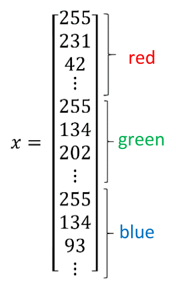

# Neural Network & Deep Learning

## 1 Introduction

### 1.1 Basic concepts

#### a simple neural network:

housing price prediction


#### ReLU function (Rectified Linear Unit):

zero at first, then takes off as a straight line


#### Multiple Neural Network:

stack single neurons together → a larger neural network 


- highly automated 
- input layer is densely connected
- enought training examples $\stackrel{supervised learning}{\longrightarrow}$ figure out functions


### 1.2 Supervised Learning

| input(x)          | output(y)              | applications        |            network type            |
| ----------------- | ---------------------- | ------------------- | :--------------------------------: |
| home features     | price                  | real estate         |      standard neural network       |
| ad, user info     | Click on ad(0/1)       | online advertising  |            standard ...            |
| image             | object(1, ..., 1000)   | photo tagging       | convolutional neural network (CNN) |
| audio             | text transcript        | speech recognition  |   recurrent neural network (RNN)   |
| English           | Chinese                | machine translation |                RNN                 |
| image, radar info | position of other cars | autonomous driving  |   custom/ hybrid neural network    |

#### structured/ unstructured data

- structured data: databases of data (has a defined meaning)
- unstructured data: audio, image, text (relatively harder to be interpreted)


### 1.3 why so popular now: scale drives deep learning progress

#### traditional learning algorithm: 

support vector machine, logistic regression ...

- unable to deal with huge amounts of data
- while **digitization** of a soceity creates more data

#### two things to enhance the performance

1. be able to train a** big enough neural network** (hidden units, parameters, connections, data ...)

2. need **a lot of data** notation:m the size of the training set


- small training sets: not very clear (your skill at hand engineering features determines the performance + some details)
- big data: large NN dominating others

#### the progress of deep learning includes:

==data + computation + algorithms==

- example of algorithm innovation: changing sigmoid to ReLU has made *gradient descent* work much faster
- computation: **hardware + algorithms**
  
- the process of training NN is iterative
- faster computation enables you to try more ideas and improve them


## 2 Basics of Neural Network programming

### 2.1 Binary Classification

the result is a **discrete** value out put (e.g. 0/1)

- don't need a "for" loop to go over your training set
- use ==forward / backward propagation==

#### a picture

→ 3 matrices of pixel intensity values (Red, Green, Blue)
→ feature vector $x$ ($n_x$: dimension = total numbers of the matrices)

- example: cat / non-cat




$n_x = 64 \times 64 \times 3$

#### some notations

  $(x, y)$: a single training example: $ (x^{(1)}, y^{(1)}), (x^{(2)}, y^{(2)})$...
  $m$: number of training examples
      $ m = m_{train}$ (training sets) / $m_{test}$ (test sets)
  $X=[x_1, x_2, ..., x_m]$
  $X.shape = (n_x, m)$
  $Y = [y_1, y_2, ..., y_m]$
  $Y.shape = (1, m)$

### 2.2 Logistic Regression

Given $x$, want $\hat{y}=P(y=1|x)$ (the probability of "y=1")
$x \in R^{n_x}$
parameters: $w \in R^{n_x}, b \in R$

if you use linear regression, you'll get $\hat{y}=w^Tx+b$, which is not satisfying
then we apply it to the sigmoid function:  $\hat{y}=σ(w^Tx+b)$

- Sigmoid function:
	$σ(z)=\frac{1}{1+e^{-z}}$
	

$\hat{y}=σ(w^Tx+b)$, where $σ(z)=\frac{1}{1+e^{-z}}$
Given$\{ (x^{(1)}, y^{(1)}), ..., (x^{(m)}, y^{(m)})\}$, want $\hat{y}^{(i)} \approx y^{(i)}$

(the superscript parentheses "i" refers to data associated with the i-th training example)
#### Loss(error) function
  (if use square error, gradient descent may not find the global optimum)
  defined with respect to a **single** training example
==$\mathcal{L}(\hat{y},y)=-(ylog \ \hat{y}+(1-y)log(1-\hat{y}))$==
notice: "log" means "ln"

Goal: make $\mathcal{L}$  as small as possible
	if $y=1$: $ \mathcal{L}(\hat{y},y)=-log\hat{y} $
		→ parameters make $\hat{y}$ close to 1
	if $y=0$: $\mathcal{L}(\hat{y},y)=-log(1-\hat{y})$
		→ parameters make $\hat{y}$ close to 0

#### Cost function

the cost of your parameters on the** entire** training set

==$J(w,b)=\frac{1}{m} \sum\limits_{i=1}^m \mathcal{L}(\hat{y}^{(i)},y^{(i)})=\frac{1}{m} \sum\limits_{i=1}^m-(y^{(i)}log \ \hat{y}^{(i)}+(1-y^{(i)})log(1-\hat{y}^{(i)}))$==

##### justification:

$$
\left.
\begin{aligned}
if \quad y = 1: &p(y|x) = \hat{y} \\
if \quad y = 0: &p(y|x) = 1 - \hat{y}
\end{aligned}
\right \} p(y|x) = \hat{y}^y (1-\hat{y})^{1-y} \\
since \quad maximizing \ p(y|x) \leftrightarrow maximizing \ log \ p(y|x)\\
then, \quad log \ p(y|x) = log \ \hat{y}^y (1-\hat{y})^{1-y} = (ylog \ \hat{y}+(1-y)log(1-\hat{y}))
$$
add the minus sign: minimizing the loss corresponds to maximizing the log of the probability
$$
\begin{align}
log \ p(labels \ in \ training \ set) & = log \ \prod\limits_{i=1}^m \ p(y^{(i)}|x^{(i)})\\
& = \sum\limits_{i=1}^m \ p(y^{(i)}|x^{(i)})\\
& = -\mathcal{L}(\hat{y}^{(i)},y^{(i)})\\
J(w,b) & = \frac{1}{m} \sum\limits_{i=1}^m \mathcal{L} \hat{y}^{(i)},y^{(i)})
\end{align}
$$
$\frac{1}{m}$: for scaling
remove the minus sign: change minimizing to maximizing

### 2.3 Gradient Descent

want to find $w,b$ that minimize $J(w,b)$

$J(w, b)$ is a convex function (makes this method possible)

1. initialize w, b (usually use 0) (random initialization is feasible)
2. start from the initial point and step towards the global optimum

Repeat {
	$w:=w-α\frac{\partial{J(w,b)}}{\partial{w}}$
	$b:=b-α\frac{\partial{J(w,b)}}{\partial{b}}$
}
notation:
	α: learning rate (controls the length of each iteration)
	$\frac{\partial{J(w,b)}}{\partial{w}}$: in code we use "dw"

- (suppose we only have 2 'x'):

$$
x_1, x_2, w_1, w_2, b \rightarrow \boxed{z=w_1x_1+w_2x_2+b} \rightarrow \boxed{a=\sigma(z)} \rightarrow \boxed{\mathcal{L}(a,y)}\\
\begin{align}
dz &= \frac{d\mathcal{L}}{dz}\\
&= \frac{d\mathcal{L}}{da} \cdot \frac{da}{dz}\\
&= (-\frac{y}{a}+\frac{1-y}{1-a}) \cdot a(1-a)\\
&= a-y\\
then, \quad
\frac{d\mathcal{L}}{dw_1}=dw_1&=x_1 \cdot dz\\
\frac{d\mathcal{L}}{dw_2}=dw_2&=x_2 \cdot dz\\
db&=dz
\end{align}
$$
apply them to gradient descent method (the "Repeat" part) to update the parameters

- (on m examples):
	$\frac{\partial}{\partial{w_1}}J(w,b)=\frac{1}{m} \sum_{i=1}^m \frac{\partial}{\partial{w_1}} \mathcal{L}(\hat{y}^{(i)},y^{(i)})$

- notice: when dealing with huge data sets, **avoid** using for-loops explicitly in the program (low effeciency), use **vectorization**

### 2.4 Vectorization

while computing $z=w^Tx+b \quad (x\in R^{n_x}, w \in R^{n_x})$:
| Non-vectorized                                               | Vectorized                             |
| ------------------------------------------------------------ | -------------------------------------- |
| z = 0  <br />for i in range(n~x~):<br />        z += w[i]*x[i]<br />z += b | import numpy<br />z = np.dot(w, x) + b |

- **SIMD**: single Instruction Multiple Data

	works on  CPU & GPU

	numpy can take much better advantage of parallelism than for-loops thanks to SIMD

#### more examples:
np.exp(), np.log(), np.abs(), np.maximum(), ...
$$
np.exp(): \quad \quad
v = 
\begin{bmatrix}
v_1 \\ v_2 \\ \vdots \\ v_m 
\end{bmatrix}
\rightarrow
u = 
\begin{bmatrix}
e^{v_1} \\ e^{v_2} \\ \vdots \\ e^{v_m} 
\end{bmatrix}
$$

#### vectorizing logistic regression & gradient descent
for iter in range(...):
$$
\begin{align}
Z & = [z^{(1)} \quad z^{(2)} \quad \cdots z^{(m)}] = w^TX + [b \quad b \quad \cdots b] \\ 
A & = [a^{(1)} \quad a^{(2)} \quad \cdots a^{(m)}] = \sigma(Z)\\
dz & = A - Y =[a^{(1)}-y^{(1)} \quad a^{(2)}-y^{(2)} \quad \cdots a^{(m)}-y^{(m)}]\\
db & = \frac{1}{m} \sum\limits_{i=1}^m dz^{(i)}\\
dw & = \frac{1}{m}Xdz^T = \frac{1}{m}[x^{(1)}dz^{(1)} +\cdots + x^{(m)}dz^{(m)}] \quad (an \quad n_x \times 1 \quad vector)\\
w & := w - \alpha dw\\
b & := b - \alpha db
\end{align}
$$
```python
# some code
import numpy as np
Z = np.dot(w.T, X) + b
db = np.sum(dz)
```
**notice**(broadcasting): here "b" is a real number, but Python will process it as a 1×m vector

### 2.5 About Python & NumPy: Some tricks

#### broadcasting

- duplicate the contents in the matrix (or a real number) to make its size appropriate
	code: [matrix].reshape(m, n)
- automated in Python, but you can use the reshape function to ensure the size of the matrix

#### data structure

```python
import numpy as np

# avoid such data structure!
a = np.random.randn(5) # rank 1 array
print(a)
print(a.T) # looks the same as a
print(np.dot(a, a.T))  # a real number

# use this↓
b = np.random.randn(5,1) # 5*1 column vector
print(np.dot(b, b.T)) # a 5*5 matrix

assert(a.shape == (5,1)) # to make sure
```


## 3 One Hidden Layer Neural Network

### 3.1 Overview

- 2-layer NN
repeat the logistic regression several times
\[ i \]: imply the number of different layers
the input layer is **not** counted


### 3.2 Computing the output

stack data into a matrix/vector to compute them simultaneously

- horizontally: different training examples
- vertically: different nodes in the NN

$$
\begin{aligned}
Z^{[1]}&=W^{[1]}X+b^{[1]}\\
A^{[1]}&=g (Z^{[1]})\\
Z^{[2]}&=W^{[2]}A^{[1]}+b^{[2]}\\
A^{[2]}&=g (Z^{[2]})\\
\end{aligned}
\begin{align}
\quad W^{[1]}&= \begin{bmatrix}
w_1^{[1]T} \\ w_2^{[1]T} \\ w_3^{[1]T} \\ w_4^{[1]T}
\end{bmatrix}\\
X = A^{[0]}&= 
\begin{bmatrix}
x^{(1)} & x^{(2)} & \cdots & x^{(m)}
\end{bmatrix}
\end{align}
$$

### 3.3 Activation Functions

activation functions can be different for different layers
#### Sigmoid function
$$
\begin{align}
a&=\frac{1}{1+e^{-z}}\\
\frac{da}{dz}&=a(1-a)
\end{align}
$$
only use this in the output layer while doing binary classification
#### Tanh function
$$
\begin{align}
a&=\frac{e^z-e^{-z}}{e^z+e^{-z}}\\
\frac{da}{dz}&=1-a^2
\end{align}
$$
a shifted version of sigmoid function
works better than sigmoid function
problem: when z is either too large or too small, the slope is close to 0, which slows down the gradient descent process
#### ReLU function
$$
\begin{align}
a&=max(0,z)\\
\frac{da}{dz}&=
\begin{cases}
0 & \text{if z < 0}\\
1 & \text{if z > 0}\\
undefined & \text{if z = 0}
\end{cases}
\\ leaky \ ReLU: \ a&=max(0.01z,z)
\end{align}
$$
**default** function of activation function
problem: derivative doesn't exist when z=0, but in practice it doesn't matter (the chance of z being precisely 0.000... is so small, and you can manually set the derivative 1 or 0; )

#### why we need a non-linear activation function?
if we use the linear activation function (identity activation function), then the output is just a linear function of the input, then the hidden layer becomes useless
sometimes, we use linear function, but it is very rare

### 3.4 Gradient Descent for Neural Networks

Parameters: $w^{[1]}, b^{[1]}, w^{[2]}, b^{[2]}, n_x = n^{[0]}, n^{[1]}, n^{[2]} = 1$
Cost function: $J(w^{[1]}, b^{[1]}, w^{[2]}, b^{[2]}) = \frac{1}{m} \sum\limits_{i=1}^m \ \mathcal{L}(\hat{y}, y)$
Gradient Descent:
$$
\begin{align}
\text{Repeat \{} &\\
&\text{Compute Predictions} \quad (\hat{y}^{(i)},i=1,2,...,m )\\
& dw^{[1]}=\frac{\partial{J}}{\partial{w^{[1]}}}\\
& db^{[1]}=\frac{\partial{J}}{\partial{b^{[1]}}}\\
& dw^{[2]}=..., \quad db^{[2]}=...\\
& w^{[1]}:=w^{[1]}- \alpha dw^{[1]} \\
& b^{[1]}:=b^{[1]}- \alpha db^{[1]} \\
& w^{[2]}:=...,\quad b^{[2]}:=...\\
&\}
\end{align}
$$
Forward Propagation:
$$
\begin{align}
Z^{[1]}&=W^{[1]}X+b^{[1]}\\
A^{[1]}&=g (Z^{[1]})\\
Z^{[2]}&=W^{[2]}A^{[1]}+b^{[2]}\\
A^{[2]}&=g (Z^{[2]})\\
\end{align}
$$
Backward Propagation:
$$
\begin{align}
dZ^{[2]}&=A^{[2]}-Y\\
dW^{[2]}&=\frac{1}{m}dZ^{[2]}A^{[1]T}\\
db^{[2]}&=\frac{1}{m}np.sum(dZ^{[2]}, \ axis=1, \ keepdims=True)\\
dZ^{[1]}&=W^{[2]T}dZ^{[2]}*g^{[1]'}(Z^{[1]}) \quad *:\text{element-wise product}\\
dW^{[1]}&=\frac{1}{m}dZ^{[1]}X^T\\
db^{[1]}&=\frac{1}{m}np.sum(dZ^{[1]}, \ asix=1, \ keepdims=True)
\end{align}
$$

### 3.5 Random Initialization

if you initialize hidden units of the same layer with the same **W** parameter, then they become symmetric and end up with the same result
parameter **b** doesn't have the symmetric problem

- solution:
	W^[1]^=np.random.rand((2,2))*0.01
	b^[1]^=np.zero((2,1))

"*0.01": if **W** is too large, it will result in very large values of **z** and causes the activation function to be saturated, thus slowing down the learning process.


## 4 Deep Neural Networks

### 4.1 Deep L-layer Neural Network

#### notations

 **L**: number of layers
**n^[l]^**: units in layer l
**a^[l]^**: activations in layer l (a^[l]^=g^[l]^(z^[l]^))
**w^[l]^**: weights for z^[l]^

$Z^{[l]}=W^{[l]}A^{[l-1]}+b^{[l]}$
$A^{[l]}=g^{[l]}(Z^{[l]})$

- use explicit for-loops to compute **each layer**

#### dimensions

$z^{[i]}=W^{[i]}a^{[i-1]}+b^{[i]}$

  W^[i]^.shape = (n^[i]^, n^[i-1]^)
  z^[i]^.shape = (n^[i]^, 1),
  a^[i-1]^.shape = (n^[i-1]^, 1)
  b^[i]^.shape = (n^[i]^, 1)
- $dW$ / $db$ should have the same dimension as $W$ / $b$
- after vectorization, the "1" becomes "m" 

#### intuition about deep NN

- different layers have different functions (from simple to complex)
  earlier layers find simple things (edges, ...)
  deeper layers compose them together to detect more complex things (eyes, noses)
- circuit theory & deep learning
  There are functions you can compute with a "small" L-layer deep neural network that shallower networks require exponentially more hidden units to compute

### 4.2 Building Blocks of Deep Neural Networks


connecting blocks like this together makes up the forward & backward propagation

### 4.3 Parameters & Hyper Parameters

- Parameters: W^[1]^, b^[1]^, W^[2]^, b^[2]^, ...

- Hyper parameters: control parameters like W, b, ...
	  α: learning rate
	  L: number of hidden layers
	  n^[i]^: hidden units
	  choice of activation function, momentum, minibatch size, regularization, ...

applied deep learning is a very **empirical** process
try out different values for parameters, iterate and find what works