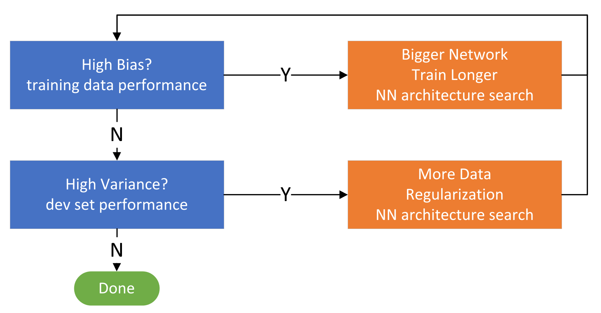

# Improving Deep Neural Networks

## 1 Setting Up your Machine Learning application

### 1.1 train / dev/ test sets


- Previously: **70%** train + **30%** test // **60%** train + **20%** dev + **20%** test
- Now (big data): 1,000,000 = 980,000(**98%**) train + 10,000(**1%**) dev + 10,000(**1%**) test
for data sets with over 1 million examples, the training set can take up 99.5%

A test set is not always necessary (depend on whether you need an unbiased estimate)

#### Mismatched train/test distribution

for example:
- training set: cat pictures from webpages
- dev/test sets: cat pictures from users using the app

One Rule: make sure that ==dev and test sets come from the same distribution==

### 1.2 Bias & Variance


| *               | High Variance | High Bias | High Bias & High Variance | Low Bias & Low Variance |
| --------------- | ------------- | --------- | ------------------------- | ----------------------- |
| Train set error | 1%            | 15%       | 15%                       | 0.5%                    |
| Dev set error   | 11%           | 16%       | 30%                       | 1%                      |
\* based on the assumption that Bayesion Optimal error is close to 0%

### 1.3 Basic "Recipe" for ML



Bias-Variance trade-off

### 1.4 Regularization

#### in logistic regression:

$$
J(w,b)=\frac{1}{m}\sum\limits_{i=1}^m\mathcal{L}(\hat{y}^{(i)},y^{(i)})+\boxed{\frac{ \lambda }{2m}||w||^2_2} \quad (+ \frac{\lambda}{2m}b^2)\\
L_2 \ regularization: \ ||w||^2_2=\sum\limits_{j=1}^{n_x}w_j^2=w^Tw\\
\text{square Euclidean norm of the parameter vector w}\\
(L_1 \ regularization: \ \frac{\lambda}{2m}|w|_1=\frac{\lambda}{2m}\sum\limits_{j=1}^{n_x}|w_j|)
$$

- omitting the regularization of **b** makes little difference (w is a high dimensional parameter vector, while b is just a single number)
- if we use L~1~ regularization, then **w** will end up being sparse (have a lot of zeros)

**notice**: "lambda" is a reserved keyword in Python, use "lambd" to represent the lambda regularization parameter

#### in neural network:

$$
J(w^{[1]},b^{[1]}, ..., w^{[l]}, b^{[l]})=\frac{1}{m}\sum\limits_{i=1}^m\mathcal{L}(\hat{y}^{(i)},y^{(i)})+\boxed{\frac{ \lambda }{2m} \sum\limits_{l=1}^l ||w^{[l]}||^2_2} \\
||w^{[l]}||^2_F=\sum\limits_{i=1}^{n^{[l-1]}} \sum\limits_{j=1}^{n^{[l]}}(w_{ij}^{[l]})^2 \quad \quad w:(n^{[l-1]},n^{[l]})\\
\text{Frobenius norm of the parameter vector w}\\
dw^{[l]}=\text{(from backprop)}+\boxed{\frac{\lambda}{m}w^{[l]}}\\
\begin{align}
\text{"weight decay"} \quad w^{[l]}&:=w^{[l]}-\alpha dw^{[l]}\\
&:= w^{[l]}-\alpha [\text{(from backprop)}+\frac{\lambda}{m}w^{[l]}]\\
&:= (1-\frac{\alpha \lambda}{m})w^{[l]}-\alpha \text{(from backprop)}
\end{align}
$$

#### why regularization reduces overfitting?

big λ causes W close to zero 
→ zero out or at least reduce the impact of many hidden units
→ a simple, but deep NN (close to logistic regression)

big λ and small W causes Z relatively small
→ the activation function (on a small range) will be relatively linear
→ the neural network will be calculating something close to a simple linear function
→ less likely to overfit

### 1.5 Dropout Regularization


for **each** example:
1. go through each of the layers
2. set some probability of eliminating a node in neural network
3. eliminate the selected nodes (remove all the ingoing & outgoing things from the selected nodes)
4. end up with a much smaller, diminished network

#### implementing dropout (inverted dropout)

L=3, keep-prob=0.8
d^3^=np.random.rand(a^3^.shape[0], a^3^.shape[1]) < keep-prob
a^3^=np.multiply(a^3^, d^3^)
a^3^ /= keep-prob  #ensure the expected value of a^3^ remains the same

NO dropout at **test** time
  the output shouldn't be random, it will add noise to your prediction

#### intuitions about dropout

##### why it works
- using a smaller network is like using a regularized network

- can't rely on any one feature, so have to spread out weights (onto differet units)

	tend to have an effect of shrinking the squared norm of the weights

##### usage:

1. lower the value of keep-prob for layers that are more likely to overfit (drawback: need to search more hyper parameters for using cross-validation)
2. apply dropout to some layers and don't apply to others

frequently used in computer vision (lack of data causes overfitting)
only use it when the function is overfitting

**downside**: while using dropout, the cost function **J** is not well-defined, so it becomes harder to check wheter the cost funtion **J** is declining. 

### 1.6 Other Regularization Methods

#### Data Augmentation

when having trouble obtaining new training data, augment the current training set

images: flip, distort, rotate, clip...
characters: rotate, distort...

#### Early Stopping


plot [dev set error] and [training error / cost function J] in the same graph
stop training **halfway**

using 1 method to solve 2 problems:

1. optimize the cost function J  -- gradient descent, ...
2. not overfit -- regularization, ...

### 1.7 Normalizing Input

1. substract/zero out the mean:

$$
\mu = \frac{1}{m}\sum\limits_{i=1}^m x^{(i)}\\
x=x-\mu
$$

2. normalize variance

$$
\sigma ^2 = \frac{1}{m}\sum\limits_{i=1}^{m}x^{(i)}**2\\
x /= \sigma ^2 \\
**: \text{element y squaring ???}
$$


- result: the variance of x1 and x2 are both equal to 1 

- tip: use the **same** μ and σ to normalize the training set and the test set 

#### why normalize?


ensure all the features on a similar scale, more symmetric, can use larger steps ...
  → easier to optimize

### 1.8 Vanishing/Exploding Gradients

if the weight parameter **w** is more\less than 1,
then in a very **deep** network, the activations increasing/decreasing **exponentially**

#### partial solution

set a reasonable **variance** of the initialization of the weight matrices
- doesn't solve but help reduce the vanishing/exploding gradients problem

for ReLU:
$$
z=w_1x_1+w_2x_2+...+w_nx_n \\
\text{larger} \ n \rightarrow \text{smaller} \ w_1 \\
\begin{align}
&\text{in order to make} \quad Var(w_i)=\frac{2}{n} \\
&\text{let} \quad W^{[l]}=\text{np.random.randn(shape)}*\boxed{\text{np.sqrt}(\frac{2}{n^{[l-1]}})} \\
\end{align}
$$
for other activations:
  tanh: $\sqrt{\frac{1}{n^{[l-1]}}}$ (Xavier Initialization),  or  $\sqrt{\frac{2}{n^{[l-1]}+n^{[l]}}}$

- set the variance as a hyperparameter
- tuning this parameter is not so effective

### 1.9 Gradient Checking

#### Numerical Approximation of Gradients

$$
\begin{align}
\text{two-sided:} \quad f'(\theta)&=\lim\limits_{\epsilon \rightarrow0} \frac{f(\theta + \epsilon)-f(\theta - \epsilon)}{2\epsilon} \quad error:O(\epsilon^2)\\
\text{one-sided:} \quad f'(\theta)&=\lim\limits_{\epsilon \rightarrow0} \frac{f(\theta + \epsilon)-f(\theta)}{\epsilon} \quad error:O(\epsilon)\\
\end{align}
$$

use **two-sided** difference (more accurate) to check the derivatives(backprop)

#### Gradient Checking for a NN

- concatenate:
  take $W^{[1]}, b^{[1]}, ..., W^{[L]}, b^{[L]}$ and reshape into a big vector $\theta$
  take $dW^{[1]}, db^{[1]}, ..., dW^{[L]}, db^{[L]}$ and reshape into a big vector $d\theta$

for each i:
$$
\begin{align}
d\theta_{approx}^{[i]}&=\frac{J(\theta_1, \theta_2,...,\theta_i+\epsilon,  ...)-J(\theta_1, \theta_2,...,\theta_i-\epsilon,  ...)}{2\epsilon} \\
d\theta^{[i]}&=\frac{\partial J}{\partial \theta_i}\\
if \ \epsilon=10^{-7}&\\
&
\left.
\text{check} \quad \frac{||d\theta_{approx}-d\theta||_2}{||d\theta_{approx}||_2+||d\theta||_2} \approx
\right \{
\begin{aligned}
&10^{-7} \ \text{great}\\
&10^{-5} \ \text{okay but double check}\\
&10^{-3} \ \text{not good}
\end{aligned}
\end{align} \\
$$

#### tips

- Don't use in trainin, only to debug
- If algorithm fails grad check, look at components to try to identify bug
- Remember regularization
- Doesn't work with dropout
- Run at random initialization; perhaps again after some training


## 2 Optimization Algorithms

### 2.1 Mini-batch Gradient Descent

 split the training set into smaller ones → mini-batches

example: (m=5,000,000)
$$
\mathop{X}\limits_{(n_x,m)}=[\underbrace{x^{(1)}x^{(2)} ... x^{(1000)}}_{X^{\{1\}}} |\underbrace{x^{(1001)}x^{(1002)} ... x^{(2000)}}_{X^{\{2\}}}|...|\underbrace{... x^{(m)}}_{X^{\{5000\}}}]\\
\mathop{Y}\limits_{(1,m)}=[\underbrace{y^{(1)}y^{(2)} ... y^{(1000)}}_{Y^{\{1\}}} |\underbrace{y^{(1001)}y^{(1002)} ... y^{(2000)}}_{Y^{\{2\}}}|...|\underbrace{... y^{(m)}}_{Y^{\{5000\}}}]\\
$$
**{i}**: different mini-batches

use $X^{\{t\}},Y^{\{t\}}$ to substitute $X,Y$ in gradient descent, use a for-loop to go through

**epoch**: a single pass through the entire training set


more noise

#### choosing the mini-batch size

- if **size = m** : Batch gradient descent
	(takes too much time per iteration, especially when the training set is large)
- if **size =1** : Stochastic gradient descent 
  (extremely noisy)
  (won't converge, oscillate around the region of the minium)
  (lose speedup from vectorization)

- choose a size **in between** (not too big or too small)

instruction:
1. small training set: use batch gradient descent
2. big training set: typical mini-batch size: $2^n$ (usually n=6~9, 10)

- make sure mini-batch $X^{\{t\}},Y^{\{t\}}$ fits in CPU/GPU memory

### 2.2 Exponentially weighted averages

example: temperature

red: β = 0.9
purple: β = 0.98 (before bias correction)
green: β = 0.98 (after bias correction)
$$
v_0=0
v_t=\beta v_{t-1}+(1-\beta)\theta_t=(1-\beta)\sum\limits_{i=1}^{t}\beta^{t-i}\theta_i
$$

```
v0=0
Repeat{
	get next theta_t
	v_theta := beta*v_theta + (1-beta)theta_t
}
```

- $v_t$ as approximately average over $\frac{1}{1-\beta}$ days' temperature
- larger β adapts more slowly to changes, but smoother and less noisy
- 0.9 is a robust value for β

#### Bias correction

$$
v_t=\frac{v_t}{1-\beta^t}
$$

mainly in the initial period
as t gets larger, the bias correction has less effects

#### 2.3 Gradient Descent with Momentum

#### Momentum


damp out oscillations in the path to the minimum

$v_{dW}=0, \  v_{db}=0$
on iteration t:
	compute $dw, db$ using current mini-batch
$$
\begin{align}
v_{dW}&=\beta v_{dW}+(1-\beta)dW\\
v_{db}&=\beta v_{db}+(1-\beta)db\\
W&:=W-\alpha v_{dW}\\
b&:=b-\alpha b_{dW}
\end{align}
$$

- 2 hyperparameters: α β
- in practice, don't use bias correction when implementing gradient descent / momentum

### 2.4 RMSprop

Root Mean Square Propagation
$$
\begin{align}
&s_{dW}=0, \  s_{db}=0 \\
\text{on iteration t:}& \\
\text{compute}& \ dw, db \ \text{using current mini-batch}\\
s_{dW}&=\beta_2 s_{dW}+(1-\beta_2)(dW)^2\\
s_{db}&=\beta_2 s_{db}+(1-\beta_2)(db)^2\\
W&:=W-\alpha \frac{dW}{\sqrt{s_{dW}}+\epsilon}\\
b&:=b-\alpha \frac{db}{\sqrt{s_{db}}+\epsilon}\\
& \quad \epsilon:\text{a very small number}(e.g. 10^{-8})
\end{align}
$$

### 2.5 Adam Optimization Algorithm

Adam: Adaptive Moment Estimation

binding momentum and RMSprop together
$$
\begin{align}
&v_{dW}=0, \ s_{dW}=0,  \ v_{db}=0, \  s_{db}=0 \\
\text{on iteration t:}& \\
\text{compute}& \ dw, db \ \text{using current mini-batch}\\
v_{dW}&=\beta_1 v_{dW}+(1-\beta_1)dW, \quad v_{db}=\beta_1 v_{db}+(1-\beta_1)db\\
s_{dW}&=\beta_2 s_{dW}+(1-\beta_2)(dW)^2, \quad s_{db}=\beta_2 s_{db}+(1-\beta_2)(db)^2\\
W&:=W-\alpha \frac{dW}{\sqrt{s_{dW}}+\epsilon}\\
b&:=b-\alpha \frac{db}{\sqrt{s_{db}}+\epsilon}\\
v_{dW}^{corrected}&=\frac{v_{dW}}{1-\beta_1^t}, \quad v_{db}^{corrected}=\frac{v_{db}}{1-\beta_1^t}\\
s_{dW}^{corrected}&=\frac{s_{dW}}{1-\beta_2^t}, \quad s_{db}^{corrected}=\frac{s_{db}}{1-\beta_2^t}\\
W&:=W-\alpha \frac{v_{dW}^{corrected}}{\sqrt{s_{dW}^{corrected}}+\epsilon}\\
b&:=b-\alpha \frac{v_{db}^{corrected}}{\sqrt{s_{db}^{corrected}}+\epsilon}
\end{align}
$$

#### hyperparameters choice:
- α: needs to be tuned
- β~1~: 0.9
- β~2~: 0.999
- ε: 10^-8^

### 2.6 Learning Rate Decay

in order to solve the mini-batch oscillating problem
$$
\begin{align}
\alpha &= \frac{1}{1+\text{decay-rate}*\text{epoch-num}}\alpha_0 & \\
or \quad \alpha &= 0.95^{\text{epoch-num}}\alpha_0 &——\text{exponentially decay}\\
\alpha &= \frac{k}{\sqrt{\text{epoch-num}}}\alpha_0 &——\text{discrete staircase}
\end{align}
$$

- manual decay: sometimes when the data set is small

### 2.7 Local Optima


- Unlikely to get stuck in a bad local optima (big data set) ↑


- more likely to stuck in saddle points ↑


- plateau: slow down the learning process ↑ (use the optimization algorithms above)


## 3 Hyperparameter Tuning

### 3.1 Tuning Process

1. don't use a grid, try **random** values (richly exploring set of possible values)


2. coarse to fine
	find a point, then zoom in to the region nearby and sample more densely


### 3.2 Appropriate Scale

use a **logarithm scale** instead of a linear scale

search α in range 0.0001 ~ 1 :
  r = -4*np.random.rand()
  α = 10^r^

search β in range 0.9 ~ 0.999 : 
  consider 1-β
(when β comes close to 1, the result becomes very sensitive, so we need to sample more densely)


### 3.3 In Practice: Panda vs. Caviar

intuitions do get stale, re-evaluate hyperparameters occasionally


- PANDA: babysitting one model (when lacking computational capacity)
	  keep watching the model and tune the parameters accordingly

- CAVIAR: trainin many models in parallel (when having enough computational resourses)
	  pick the one that works best

### 3.4 Batch Normalization

normalize activations

#### implementing batch norm

For a deep network, after normalizing inputs (see 1.7), we can also normalize a^[l]^ so as to train w^[l]^, b^[l]^ faster
$$
\text{Given some intermediate values in NN (in layer l):} \ \underbrace{z^{(i)}, ..., z^{(n)}}_{z^{[l](i)}}\\
\begin{align}
\text{(mean):} \quad \mu &= \frac{1}{m}\sum\limits_i z^{(i)} \\
\text{(variance):} \quad \sigma^2 &= \frac{1}{m}\sum\limits(z_i-\mu)^2\\
z_{norm}^{(i)} &= \frac{z^{(i)}-\mu}{\sqrt{\sigma^2+\epsilon}} \quad\quad \text{(ε：in case σ=0)}\\
\tilde{z}^{(i)} &= \gamma z_{norm}^{(i)}+\beta\\
if \quad \gamma=\sqrt{\sigma^2+\epsilon}, \ \beta=\mu, \ then \ \tilde{z}^{(i)}=z^{(i)}
\end{align}
$$
use $\tilde{z^{(i)}}$ to replace $z^{(i)}$
normalize the mean and variance of these hidden unit values
controlled by 2 learnable parameters γ, β,which allow you to freely set the value of $\tilde{z}$

#### fitting batch norm into a neural network

the Batch Norm happens between computing **z** and computing **a**
$$
x \xrightarrow{w^{[1]},b^{[1]}}
z^{[1]} \xrightarrow[\text{Batch Norm}]{\beta^{[1]}, \gamma^{[1]}}
\tilde{z}^{[1]} \rightarrow
a^{[1]}=g^{[1]}(\tilde{z}^{[1]}) \xrightarrow{w^{[2]},b^{[2]}}
z^{[2]} \xrightarrow[\text{BN}]{\beta^{[2]}, \gamma^{[2]}}
\tilde{z}^{[2]} \rightarrow a^{[2]} \rightarrow ...
$$

- use batch norm along with mini-batch, in which case the parameter **b** gets zeroed out (can be omitted)

$$
\begin{align}
& \text{for t=1...n use mini-batch} \\
& \quad \text{compute forward prop on } X^{\{t\}} \\
& \quad \quad \text{in each hidden layer, use BN to replace } z^{[l]} \text{with } \tilde{z}^{[l]} \\
& \quad \text{use backprop to compute } dw^{[l]}, d\beta^{[l]}, d\gamma^{[l]} \\
& \quad \text{update parameters } w^{[l]}=w^{[l]}-\alpha dw^{[l]}, \beta^{[l]}=..., \gamma^{[l]}=...
&

\end{align}
$$

- can be also used with momentum, RMSprop, Adam ...

#### why does batch norm work?

"covariate shift"

- **z** can change, but the mean and variance remains the same
- Reduce the amout of shifts of the distribution of these hidden units' values
- Ease the problem of input values changing, stablize the input values for each layer
- Make each layer more adaptive to changes and more independent from other layers

#### batch norm as regularization

- Each mini-batch is scaled by the mean/variance computed on just that mini-batch
- BN adds some noise to the values  z^[l]^ within that mini-batch. So similar to dropout, it adds some noise to each hidden layer's activations
- BN has a slight regularization effect

#### batch norm at test time

- during training time, μ and σ^2^ are computed on an entire mini-batch

- but at test time, the network process a single example at a time
  need to estimate μ and σ^2^ (implement exponentially weighted average or others)

### 3.5 Softmax Regression

multi-class classification

#### activation function

**C** : number of classes (C=2, softmax → logistic regression)
output: a (C,1) vector
$$
\begin{align}
z^{[l]}&=w^{[l]}a^{[l-1]}+b^{[l]}\\
\text{softmax activation function:}\\
t&=e^{z^{[l]}}\\
a^{[l]}&=\frac{e^{z^{[l]}}}{\sum\limits_{j=1}^{C}t_i},\quad
a_i^{[l]}=\frac{t_i}{\sum\limits_{j=1}^{C}t_i} \\
\end{align}
$$
$$
\begin{aligned}
\text{example:} &\\
z^{[L]}&=\left[\begin{array}{c}
5 \\
2 \\
-1 \\
3
\end{array}\right] \quad \quad \mathrm{t}=\left[\begin{array}{c}
e^{5} \\
e^{2} \\
e^{-1} \\
e^{3}
\end{array}\right] \\
a^{[L]}_{\text{softmax}} &=g^{[L]}\left(z^{[L]}\right)=\left[\begin{array}{c}
e^{5} /\left(e^{5}+e^{2}+e^{-1}+e^{3}\right) \\
e^{2} /\left(e^{5}+e^{2}+e^{-1}+e^{3}\right) \\
e^{-1} /\left(e^{5}+e^{2}+e^{-1}+e^{3}\right) \\
e^{3} /\left(e^{5}+e^{2}+e^{-1}+e^{3}\right)
\end{array}\right]=\left[\begin{array}{c}
0.842 \\
0.042 \\
0.002 \\
0.114
\end{array}\right] \\
a^{[L]}_{\text{hardmax}}&=\left[\begin{array}{c}
1 \\
0 \\
0 \\
0
\end{array}\right]
\end{aligned}
$$

hardmax: the biggest element outputs 1, others 0

#### Loss function

$$
\begin{align}
\mathcal{L}(\hat{y}, y) &=-\sum\limits_{j=1}^C y_j \ log\hat{y}_j \\
J(w^{[1]},b^{[1]},...) &=\frac{1}{m}\sum\limits_{i=1}^{m}\mathcal{L}(\hat{y}^{(i)}, y^{(i)})\\
Y&=[y^{(1)},y^{(2)},...,y^{(m)}] \quad (C,m)\text{ matrix}
\end{align}
$$

#### gradient descent with softmax

$$
\text{forward } \quad z^{[L]}\rightarrow a^{[L]}=\hat{y} \rightarrow \mathcal{L}(\hat{y},y)\\
\text{backprop } \quad dz^{[L]}=\hat{y}-y
$$


### 3.6 Deep Learning Frameworks

Caffe/Caffe2, CNTK, DL4J, Keras, Lasagne, mxnet, PaddlePaddle, TensorFlow, Theano, Torch ...

Choosing deep learning frameworks
- Ease of programming (development and deployment)
- Running speed
- Truly open (open source with good governance)

#### TensorFlow

```python
# tensorflow ver 1.2.1

import numpy as np
import tensorflow as tf

coefficients = np.array([[1.], [-10.], [25.]])

w = tf.Variable(0,dtype=tf.float32)  #the parameter we are trying to optimize
x = tf.placeholder(tf.float32, [3,1]) #put data into it
# only need to implement the forward prop, tensorflow has built-in backward functions
# cost = tf.add(tf.add(w**2, tf.multiply(-10.,w)), 25)
# cost = w**2 - 10*w + 25 #tensorflow overloads the functions
cost = x[0][0]*w**2 + x[1][0]*w + x[2][0]
train = tf.train.GradientDescentOptimizer(0.01).minimize(cost)
init = tf.global_variables_initializer()
session = tf.Session()
session.run(init)
print(session.run(w))
# with tf.Session() as session:
#   session.run(init)
#   print(session.run(w))

for i in range(1000):
    session.run(train, feed_dict={x:coefficients})
print(session.run(w))
```


2020.08
Marcus
Written with Typora