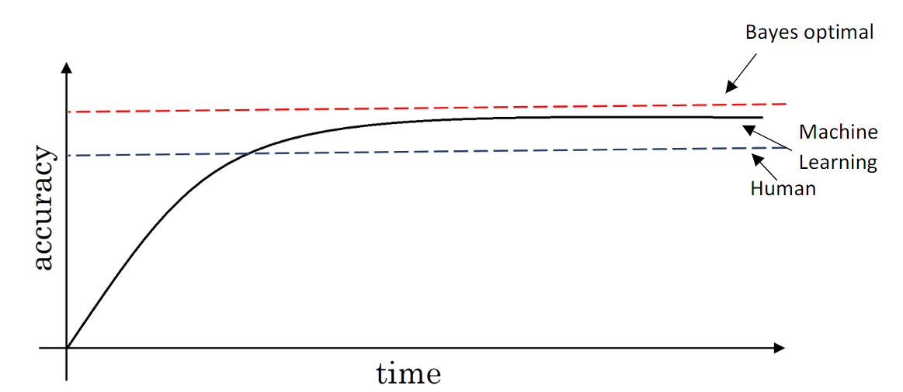

# Structured Machine Learning Projects

## 1 ML Strategy (Pt.I)

ideas for how to improve the NN performance:
- collect more data
- collect more diverse training set
- train algorithm longer with gradient descent
- try Adam instead of gradient descent
- try bigger/smaller network
- try dropout
- add L~2~ regularization
- network architecture (activation functions, hidden units, ...)

choose **the right strategy**

### 1.1 Orthogonalization

Orthogonalization or orthogonality is a system design property that assures that modifying an instruction or a component of an algorithm will not create or propagate side effects to other components of the system. It becomes easier to verify the algorithms independently from one another, it reduces testing and development time.

#### chain of assumptions in ML

1. fit training set well on cost function
    (bigger NN, better optimization algorithm, ...)
2. fit dev set well on cost function
    (regularization, bigger training set, ...)
3. fit test set well on cost function
    (bigger development set, ...)
4. performs well in real world
    (change cost function, dev set, ...)

find exactly where the problem is and solve it without affecting other irrelavent aspects

### 1.2 Setting Up Your Goal

#### single number evaluation metric

**Precision (P)**: of all the example predicted true, what fraction of it *is* true?
**Recall (R)**: of all the examples that are true, what fraction of it did we correctly predicted?

- use **1** evaluation metric:

$$
\text{F1 score:} \quad \frac{2}{\frac{1}{P}+\frac{1}{R}}
$$

- use **dev set** to evaluate the precision and recall + use **F1 score** to evaluate the overall performance = speed up the iteration process

#### satisfying and optimizing metrics

**optimizing** metric: as good as possible
**satisfying** metric: only need to meet the expectation
$$
\left.
N_{\text{metric}}=
\right \{
\begin{align}
& 1 \quad\quad\quad  \text{optimizing}\\
& N-1 \quad \text{satisfying}
\end{align}
$$

example:
  cat classifier: cost = accuracy -0.5*running_time
  trigger words: maximize accuracy s.t. ≤1 false positive per day

#### train/dev/test distributions

(see *chapter2-1.1*)

**GUIDELINE**: 

1. Choose a dev set and test set to reflect data you expect to get in the future
2. Ensure the dev & test set come from the same distribution (randomly **shuffle** all the data into dev & test set)
3. The dev set has to be big enough to evaluate different ideas
4. The test set helps evaluate the performance of the final classifier
5. Set your test set to be big enough to give high confidence in the overall perforamance of your system
6. Consider important to do well on.

#### when to change dev/test sets and metrics

- if the current evaluation metric is not giving the correct rand order preference for what is actually better algorithm, then think about defining a new evaluation metric.
	(example: cat classifier vs. pornographic images)

giving larger weight to unacceptable results when computing classification error
$$
\text{Error}_1:\quad \frac{1}{m_{dev}}\sum\limits_{i=1}^{m_{dev}}\mathcal{L}\{\hat{y}^{(i)}\neq y^{(i)}\}\\
\boxed{
\text{Error}_2:\quad \frac{1}{\sum w^{(i)}}\sum\limits_{i=1}^{m_{dev}}w^{(i)}\mathcal{L}\{\hat{y}^{(i)}\neq y^{(i)}\}}\\

\left.
w^{(i)}=
\right \{
\begin{align}
& 1 \quad \text{if} \ x^{(i)} \text{is acceptable}\\
& 10 \quad \text{if} \ x^{(i)} \text{is unacceptable}
\end{align}
$$

- If doing well on your metric + dev/test set does not correspond to doing well on your application, change your metric and/or dev/test set.
	(example: high-resolution cat images vs. low-quality cat images)

### 1.3 Comparing to Human-level Performance

#### why

Humans are quite good at a lot of tasks. So long as ML is worse than humans, you can:

- get labeled data from humans
- gain insight from manual error and analysis (why did a person get this right?)
- better analysis of bias/variance

#### some terms

- human-level: proxy for Bayes error [depends on the purpose of the analysis] 
- avoidable bias: training set error - the human level error
- variance: dev set error - training set error

human-level error is not a fixed value, it varies in different circumstances

|      example:       |                         |  Classification error (%)   |                                     |
| :-----------------: | :---------------------: | :-------------------------: | :---------------------------------: |
|                     |     **Scenario A**      |       **Scenario B**        |           **Scenario C**            |
|     **Humans**      |        1/0.7/0.5        |          1/0.7/0.5          |                 0.5                 |
| **Training error**  |            5            |              1              |                 0.7                 |
|    **Dev error**    |            6            |              5              |                 0.8                 |
| **Avoidable error** |           ≈4            |             ≈0              |                 0.2                 |
|    **Variance**     |            1            |              4              |                 0.1                 |
|    **Guideline**    | focus on bias reduction | focus on variance reduction | human-level error selection matters |

- If the difference between human-level error and the training error is bigger than the difference between the training error and the development error. The focus should be on **bias reduction** technique.
- If the difference between training error and the development error is bigger than the difference between the human-level error and the training error. The focus should be on **variance reduction** technique.

### 1.4 Surpassing Human-level Performance

in this case, the conventional ways to know if bias/variance reduction are not working

problems where machine learning significantly surpasses human-levle performances:
(especially non-natural perception problems with lots of structured data)

- online advertising
- product recommendation
- logistics
- loan approvals
- ...

in some natural perception areas:

- speech recognition
- some image recognition
- medical (diagnosis)

### 1.5 Improving your Model Performance

2 fundamental **assumptions** of supervised learning:

1. You can fit the training set pretty well
2. The training set performance generalizes pretty well to the dev/test set

Guideline:

## 2 ML Strategy (Pt.II)

### 2.1 Error Analysis

example: cat classifier

1. Get ~100 mislabeled dev set examples
2. Count up errors that fall into different categories and calculate their fractions 

help you prioritize the problems
(generate new categories) give you inspiration for new directions to go in

#### cleaning up incorrectly labeled data

DL algorithms are quite robust to **random** errors in the training set.
but less robust to **systematic** errors

1. add an extra column "incorrectly labeled" to the error analysis table
2. whether to fix the problem depends on to what degree did it affect the training process (its fraction compared with other errors, whether it affects the choice of a better algorithm)

tips:
- Apply same process to your dev and test sets to make sure they continue to come from the same distribution.
- Consider examining examples your algorithm got right as well as ones it got wrong.
- Train and dev/test data may now come from slightly different distributions.

advice:
- Building practical systems need more manual error analysis and human insight.
- Spend some time to check and analysis the data and errors. It's worth it.

### 2.2 build your first system quickly, then iterate

don't overthink too much about the problem(especially when you're not very experienced and don't have a lot of literature to refer to)

1. Set up dev/test set and metric
2. Build initial system quickly
3. Use Bias/Variance analysis & Error analysis to prioritize next steps

### 2.3 Mismatched Training & dev/test data

#### training and testing on different distributions

problem: 
distribution 1 is large enough but doesn't match your target
distribution 2 matches your target but is too small to be a training set

solution:
use target distribution as dev/test set

example: speech activated rearview mirror

- Training: purchased data, smart speaker control, voice keyboard, ...
- Dev/test: Speech activated rearview mirror

#### bias&variances with mismatched data distributions

**Training-dev set**: same distribution as training set, but not used for training

| [example]              |          | Classification Error(%) |      |                      |
| ---------------------- | :------: | :---------------------: | :--: | :------------------: |
| **Human-level error**  |    ~0    |           ~0            |  ~0  |          ~0          |
| **Training error**     |    1     |            1            |  10  |          10          |
| **Training-dev error** |    9     |           1.5           |  11  |          11          |
| **Dev error**          |    10    |           10            |  12  |          20          |
| **Problem**            | Variance |      Data Mismatch      | Bias | Bias + Data Mismatch |

#### addressing data mismatch

- Carry out manual error analysis to try to understand difference between training and dev/test sets
- Make training data more similar to the dev set; or collect more data similar to dev/test sets

**artificial data sythesis**:
  example: voice + car noise = synthesized in-car audio
be cautious about simulating data only from a tiny subset of the space of all possible examples (e.g. overusing the car noise might make the network overfit the car noise)

### 2.4 Transfer Learning

Storing knowledge gained while solving one problem and applying it to a different but related problem.

1. remove the output layer of the network
2. add one or several new layers into the network, feed new data into the network to train

#### when transfer learning makes sense:

- Task A and B have the same input x
- You have a lot more data for Task A than Task B
- Low level features from A could be helpful for learning B

### 2.5 Multi-task Learning

Multiple learning tasks are solved at the same time, while exploiting commonalities and differences across tasks

example: identifying pedestrians, cars, traffic lights and stop signs in the same picture

- much less used than transfer learning
- sometimes have better performance than training different networks to do the tasks in isolation
- can train on an incompletely labeled training set ('?' instead of 0/1)
- the loss function only sum over values with 0/1 label
$$
\text{Loss:} \quad\frac{1}{m}\sum\limits_{i=1}^{m}\sum\limits_{j=1}^{t}\mathcal{L}\{\hat{y}_j^{(i)}, y_j^{(i)}\}\\
\mathcal{L}: \text{usual logistic loss}
$$

#### when multi-task learning makes sense:

- Training on a set of tasks that could benefit from having shared lower-level features
- Usually: Amount of data you have for each task is quite similar
- Can train a big enough neural network to do well on all the tasks

### 2.6 End-to-end Deep Learning

handle all the stages associated with a certain task or solution

example: speech recognition

#### whether to apply end-to-end deep learning

**Pros:** 

- Let the data speak (rather than being forced to reflect human preconceptions)
- Less hand-designing of components needed

**Cons:**

- May need large amout of data
- Excludes potentially useful hand-designed components (which could sometimes be very useful especially when lacking data)

Key question:
  Do you have **sufficent data** to learn a function of the complexity needed to map x to y?

2020.08
Marcus
Written with Typora