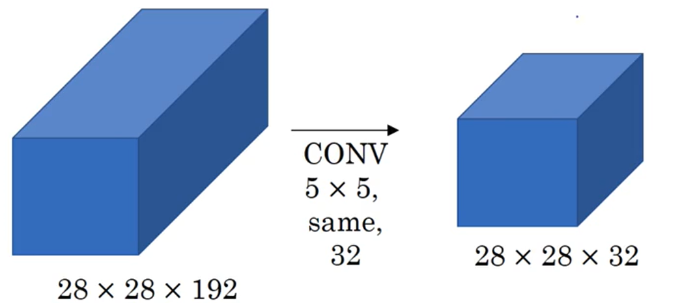
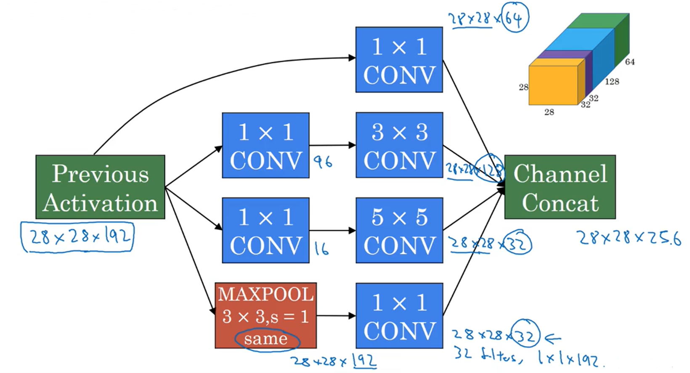
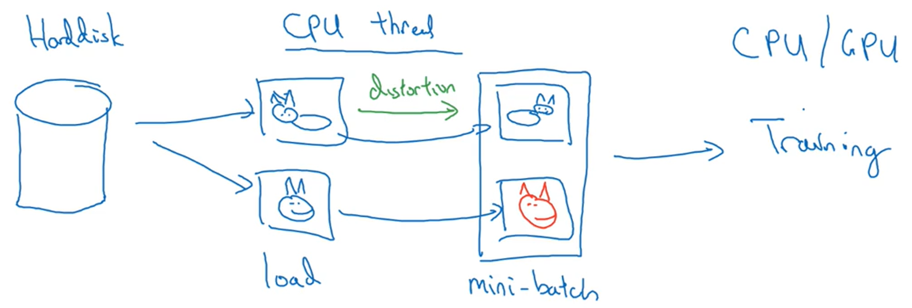
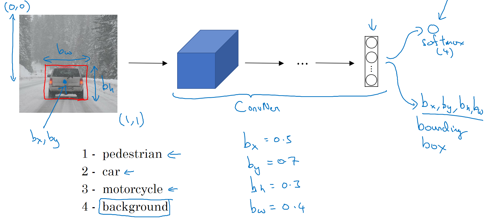

# Convolutional Neural Networks

## 1 Convolutional Neural Networks

### 1.1 Computer Vision

applications:

- Image classification
- Object detection
- Neural style transfer
- ...

problems with large images: 

- large dimensions: memory cost
- too much parameters: hard to get enough data to prevent the network from overfitting

### 1.2 Edge Detection

#### vertical edge detection

image * filter/kernel = result
*: "convolution" 

#### more edge detection

### 1.3 Padding

$n\times n \quad * \quad f \times f \quad = \quad n-f+1 \quad \times \quad n-f+1$

Downside:

1. the output image shrinks after each convolution
2. lose a lot of information at the edge of the image

Solution: pad the image with an additional border of $p$ pixels (value 0) all around the edges

1. **Valid** convolution: no padding

2. **Same** convolution: pad so that output size is the same as the input size
	  padding width: $p=\frac{f-1}{2}$ (f is usually odd)

### 1.4 Strided Convolutions

padding: p    stride: s    $\lfloor z \rfloor = floor(z)$

$n\times n \quad * \quad f \times f \quad = \quad \lfloor \frac{n+2p-f}{s}+1 \rfloor \quad \times \quad \lfloor\frac{n+2p-f}{s}+1 \rfloor$

#### Technical note on Cross-correlation vs. Convolution

operator ' * ':

1. cross-correlation: (in math) includes a double flip operation (satisfy the associative law)
2. convolution: (in ML) omits the double flip operation

### 1.5 Convolution over Volumes

$$
n \times n \times n_c \quad * \quad f \times f \times n_c \quad = \quad n-f+1 \quad \times \quad n-f+1 \quad \times \quad n_c'
$$
n~H~/n~W~: height/width
n~c~: number of channels (depth)
n~c~': times of convolution

- apply the convolution filter on each channel, add up the result
- different channels of a filter can have different size / values

### 1.6 One Layer of a Convolutional Network

after convolution, use parameter w, b and use activation function 

- the number of parameters of each layer is fixed and depends on filters (less prone to overfit)

if layer l is a convolution layer:
$$
\begin{align}
&f^{[l]} = \text{filter size} \quad p^{[l]} = \text{padding} \quad s^{[l]} = \text{stride} \\
\text{Each filter is: } & f^{[l]} \times f^{[l]} \times n_c^{[l-1]} \\
\text{Activations: } & a^{[l]} \rightarrow n_H^{[l]} \times n_W^{[l]} \times n_c^{[l]} \quad A^{[l]}=m \times n_H^{[l]} \times n_W^{[l]} \times n_c^{[l]}\\
\text{Weights: } &f^{[l]} \times f^{[l]} \times n_c^{[l-1]} \times n_c^{[l]}\\
\text{bias: } &n_c^{[l]} --(1,1,1,n_c^{[l]})\\
\text{Input: } & n_H^{[l-1]} \times n_W^{[l-1]} \times n_c^{[l-1]} \\
\text{Output: } & n_H^{[l]} \times n_W^{[l]} \times n_c^{[l]} \quad \quad n_W^{[l]}=\lfloor \frac{n_W^{[l-1]}+2p^{[l]}-f^{[l]}}{s^{[l]}} +1\rfloor
\end{align}
$$

#### a simple example

types of layer in a convolutional network:

- convolution (CONV)
- Pooling (POOL)
- Fully connected (FC)

### 1.7 Pooling Layer

#### max pooling

hyperparameters(fixed): $f, s  \ (p\text{ is usually }0)$ 
find the maximum value in the filter area, repeat the process on all the channels

#### average pooling

similar to max pooling, but used less often

### 1.8 Example

- width & height gradually decrease, channels increase
- one or more CONV layers followed by a POOL layer
- FC layers at last

### 1.9 Why Convolutional Network

**Parameter sharing**: A feature detector (such as a vertical edge detector) that's useful in one part of the image is probably useful in another part of the image.

**Sparsity of connections**: In each layer, each output value depends only on a small number of inputs.

## 2 Deep Convolutional Networks: Case Study

gain intuition, learn from / use others' network architecture, able to read some papers

- Classic networks: LeNet-5, AlexNet, VGG, ...
- ResNet (Residual Network)
- Inception

### 2.1 Classic Networks

#### LeNet-5

- ≈60k parameters
- advanced: sigmoid/tanh → ReLU

#### AlexNet

- similar to LeNet, but much bigger (≈60M parameters)
- use ReLU
- Multiple GPUs
- Local Response Normalization (LRN): doesn't help too much

#### VGG-16

CONV = 3×3 filter, s = 1, same
MAX-POOL = 2×2, s = 2

- deep but simple & systematic
- ≈138M parameters

### 2.2 Residual Networks (ResNets)

#### residual block

$$
a^{[l+2]}=g(z^{[l+2]}+a^{[l]})
$$
pass information deeper into the neural network
shortcut is added before the ReLU

#### residual network

a **plain** network's training error gets worse if it's too **deep**

#### why it works

$$
\begin{align}
\text{ReLU:} \quad a^{[l+2]}&=g(z^{[l+2]}+a^{[l]})\\
&=g(w^{[l+2]}a^{[l+1]}+b^{[l+2]}+a^{[l]})\\
if \ w^{[l+2]}=b^{[l+2]}=0,\quad &=g(a^{[l]})\\
&=a^{[l]}
\end{align}
$$

- It's easy for the residual block to learn the identity function (but it's hard for normal deep networks to learn even the identity function)
	so adding the extra layers doesn't hurt the network's performance
	and sometimes the extra layers will learn something useful
- same conv: $a^{[l]}$ and $a^{[l+2]}$ have the same dimension

- if $a^{[l+2]}$ and $a^{[l]}$ have different dimensions, add a parameter $W_s$ (matrix) before the $a^{[l]}$ in the residual block, or enlarge $a^{[l]}$ with zeros

### 2.3 Network in Network & 1×1 Convolutions

make sense especially when the input have several channels

- shrink the number of channels
	

### 2.4 Inception Network Motivation

doesn't need to decide what to do, but do them all and stack the output together and let the network learn & decide whatever parameters it wants to use, what are the combinations of these filter sizes, ...

#### computational cost

- example 1:

cost: $28 \times 28 \times 32 \times 5 \times 5 \times 192 = 120M$

- example 2: cost reduced
use 1×1 layer to create a bottleneck layer, thereby reducing the computational cost

  **bottleneck** layer: the smallest part of the network
  cost1: $28 \times 28 \times 16 \times 192 = 2.4M$
  cost2: $28 \times 28 \times 32 \times 5 \times 5 \times 16= 10.0M$
  total cost: $2.4M+10.0M=12.4M$

### 2.5 Inception Network

#### an inception module

#### GoogLeNet

halfway softmax output: help prevent the network from overfitting

### 2.6 Using Open-source Implementations

build your own network upon pretrained models, take pretrained networks' parameters as initializations, apply transfer learning

- small data set: freeze the previous layers, only train the softmax layer
- bigger data set: freeze less previous layers, train more layers

### 2.7 Data Augmentation

- Mirroring (flipping)
- Random cropping (contain the object)
- Rotation, Shearing, Local warping
- Color shifting
  change the R,G,B value
  (PCA color augmentation)

#### implementing distortions during training

### 2.8 The State Computer Vision

#### 2 sources of knowledge:

- labeled data
- hand engineered features / network architecture / other components

#### tips for doing well on benchmarks/ winning competitions

- Ensembling:Ensembling
	Train several networks independently and average their outputs
- Multi-crop at test time
	Run classifier on multiple versions of test images and average results
	10-crop (center, corner)
	

#### use open source code

- Use architectures of networks published in the literature
- Use open source implementations if possible
- Use pretrained models and fine-tune on your dataset

## 3 Object Detection

### 3.1 Object Localization

#### classification with localization

$$
y=
\begin{bmatrix}
p_c \\ b_x \\ b_y \\ b_h \\ b_w \\ c_1 \\ c_2 \\ c_3 \\
\end{bmatrix}
\quad \quad
y_1=
\begin{bmatrix}
1 \\ b_x \\ b_y \\ b_h \\ b_w \\ 0 \\ 1 \\ 0 \\
\end{bmatrix}
\quad \quad
y_1=
\begin{bmatrix}
0 \\ ? \\ ? \\ ? \\ ? \\ ? \\ ? \\ ? \\
\end{bmatrix} \\
\begin{align}
p_c: &\text{ is there any object}\\
b_x, b_y, b_h, b_w: & \text{ bounding box location}\\
c_1, c_2, c_3: &\text{ class label}\\
'?': &\text{ "don't care"}
\end{align} \\
\left.
\mathcal{L}(\hat{y},y)=
\right \{
\begin{aligned}
&(\hat{y}_1-y_1)^2+(\hat{y}_2-y_2)^2+...+(\hat{y}_\gamma-y_\gamma)^2 \quad &if \ y_1=1 \\
&(\hat{y}_1-y_1)^2 \quad & if \ y_1=0 \\
\end{aligned}
$$

### 3.2 Landmark Detection

landmark: key positions on the image (corner of the eye, elbow, ...)

add $l_{1x}, l_{1y}, l_{2x}, l_{2y}, ...$ to the output (the xy coordinates of landmarks)

### 3.3 Sliding Windows Detection

Example: Car Detection

1. start off with closely cropped images, train the network
2. slide the window across every position in the image with a fixed stride
3. pass the cropped images into the neural network and do classification
4. change the window size and repeat the steps

problem: low efficiency (computational cost vs. performance) (depend on the window size, stride, ...)

### 3.4 Convolutional Implementation of Sliding Windows

#### turing FC layer into convolution layers

#### convolutional implementation of sliding windows

 instead of repeating sliding windows, implement the entire image at the same time using the conv network

### 3.5 Bounding Box Predictions

#### introduction to YOLO algorithm

add grids onto the image
apply the image classification and localizationg algorithm to each of the grids
(find center point of the object,)

example:

total output: 3×3×8 

- use one network, share a lot of computation (efficient, fast)

$b_x , b_y , b_h , b_w$ are specified relative to the grid cell ( $b_h , b_w$ can be bigger than 1)

### 3.6 Intersection Over Union

#### evaluating object localization

a measure of the overlap between 2 bounding boxes:
  1-ground truth bounding box (red in the picture)
  2-algorithm's result (purple)

use higher threshold (0.6, ...) means more stringent criteria

### 3.7 Non-max Suppression

for an object across several grids, the network may end up with multiple detections of the object, we need to clean up the unnecessary detections

### 3.8 Anchor Boxes

#### overlapping objects 

- Previously: Each object in training image is assigned to grid cell that contains that object's midpoint (output: 3×3×8)
- With 2 anchor boxes: Each object in training image is assigned to grid cell that contains object's midpoint and anchor box for the grid cell with highest IoU. (output: (grid cell, anchor box) 3×3×16)

1. predefine several anchor boxes (usually 5 or more)
2. associate appropriate anchor boxes with detected objects (compare IoU)

problems(unable to solve):

1. more than two objects in one grid cell
2.  two objects in one grid cell and have similar anchor boxes

manually choose several anchor box shapes
advanced: automatically choose

### 3.9 YOLO Algorithm (putting it together)

#### training 

#### making predictions

#### outputting the non-max suppressed

- For each grid call, get 2 predicted bounding boxes
- Get rid of low probability predictions
- For each class (pedestrian, car, motorcycle), use **non-max suppression** to generate final predictions.

### 3.10 RPN

#### Region proposal: R-CNN

run the classifier only on a few proposed windows (may have objects)
use segmentation algorithm to divide the image into different blobs, place bounding boxes around these blobs

#### faster algorithms

- **R-CNN**: (too slow)
	Propose regions. Classify proposed regions one at a time. Output label + bounding box.
- **Fast R-CNN**:
	Propose regions. Use convolution implementation of sliding windows to classify all the proposed regions.
- **Faster R-CNN**: 
	Use convolutional network to propose regions.

## 4 Face Recognition & Neural Style Transfer

### 4.1 Face verification vs. face recognition

Verification:
- Input image, name/ID
- Output whether the input image is that of the claimed person

Recognition:
- Has a database of K persons
- Get an input image
- Output ID if the image is any of the K persons (or "not recognized")

### 4.2 One-shot Learning

Learning from one example to recognize the person again

one example is not enough to train a CNN+softmax model

#### learning a "similarity" function

d(img1, img2) = degree of difference between images

Verification:
  if d(img1, img2) ≤ τ ——"same"
  if d(img1, img2) ＞τ ——"different"

### 4.3 Siamese Network

Parameters of NN define an encoding $f(x^{(i)})$
Learn parameters so that:
  if $x^{(i)}, x{(j)}$ are the same person, $||f(x^{(i)})-f(x^{(j)})||^2$ is small
  if $x^{(i)}, x{(j)}$ are different persons, $||f(x^{(i)})-f(x^{(j)})||^2$ is large

### 4.4 Triplet Loss Function

3 images: Anchor(A), Positive(P), Negative(N)

want
$$
||f(A)-f(P)||^2 + \alpha \leq ||f(A)-f(N)||^2 \\
d(A, P) + \alpha \leq d(A, N)
$$
**α**: margin (a hyperparameter) 
prevent the function from outputting all zeroes
push the anchor-positive pair & the anchor-negative pair further away from each other

#### loss function

$$
\begin{align}
&\text{Given 3 images: } A,P,N\\
&\mathcal{L}(A,P,N)=max(||f(A)-f(P)||^2 - ||f(A)-f(N)||^2 + \alpha, 0 )\\
&J=\sum\limits_{i=1}^m\mathcal{L}(A^{(i)},P^{(i)},N^{(i)})
\end{align}
$$

- need multiple pictures of the same person
- Choose the triplets wisely
	During training, if A, P, N are chosen randomly, $d(A, P) + \alpha \leq d(A, N)$ is easily satisfied
	Choose triplets that're "hard" to train on: $d(A, P) \approx  d(A, N)$

better to use others' pretrained models

### 4.5 Face Verification & Binary Classification

- turn face verification into a binary classification problem
- alternative to triplet loss
- use precomputation to store images as their encodings

$$
\hat{y}=\sigma (\sum\limits_{k=1}^{128}\omega_i \underbrace{|f(x^{(i)})_k-f(x^{(j)})_k|}_{\text{or use } \chi^2=(f(x^{(i)})_k-f(x^{(j)})_k)^2}+b)\\
$$
create a training set of **pairs** of images
Learn parameters so that:
  if $x^{(i)}, x{(j)}$ are the same person, output 1
  if $x^{(i)}, x{(j)}$ are different persons, output 0

### 4.6 Neural Style Transfer

#### what are conv layers learning

Pick a unit in layer 1. Find the nine image patches that maximize the unit's activation
Repeat for other units

- units in the first few layers usually look for simple features (such as an edge or a particular shade of color)
- later units usually see larger image patches and more complex patterns

#### cost function

$$
J(G)=\alpha J_{\text{content}}(C,G)+\beta J_{\text{style}}(S,G)
$$

1. Initiate G randomly
	G: 100×100×3

2. Use gradient descent to minimize J(G)
	$$
	G:=G-\frac{\partial}{\partial{G}}J(G)
	$$
	

#### content cost function

- Say you use hidden layer l (neither too shallow nor too deep) to compute content cost
- Use a pre-trained ConvNet (e.g. VGG)
- Let $a^{[l](C)}$ and $a^{[l](G)}$ be the activation of layer l on the images (unrolled into vectors)
- If  $a^{[l](C)}$ and $a^{[l](G)}$ are similar, both images have similar content

$$
J_{\text{content}}(C,G)=\frac{1}{2}|| a^{[l](C)} - a^{[l](G)} ||^2
$$

#### style cost function

Say you're using layer l's activation to measure "style"
Define style as **correlation** between activation across channels

correlation: measure of how often these high-level features occur/ don't occur together in different parts of the image

$$
\text{Let } a_{i,j,k}^{[l]} = \text{activation at } \underbrace{(i,j,k)}_{H,W,C}. \quad G^{[l](S)}\text{ is }n_c^{[l]} \times n_c^{[l]}\\
\begin{align}
G^{[l](S)}_{kk'}&=\sum\limits_{i=1}^{n_H^{[l]}}\sum\limits_{j=1}^{n_W^{[l]}}a_{i,j,k}^{[l](S)}a_{i,j,k'}^{[l](S)} \quad \quad \text{"gram matrix"/"style matrix"}\\
G^{[l](G)}_{kk'}&=\sum\limits_{i=1}^{n_H^{[l]}}\sum\limits_{j=1}^{n_W^{[l]}}a_{i,j,k}^{[l](G)}a_{i,j,k'}^{[l](G)}\\
J_{\text{style}}^{[l]}(S,G)&=||G^{[l](S)}-G^{[l](G)}||^2_F\\
&=\frac{1}{(2n_H^{[l]}n_W^{[l]}n_C^{[l]})^2}\sum\limits_k \sum\limits_{k'}(G^{[l](S)}_{kk'}-G^{[l](G)}_{kk'})^2\\
J_{\text{style}}(S,G)&=\sum\limits_l \lambda^{[l]} J_{\text{style}}^{[l]}(S,G)
\end{align}
$$

### 4.7 1D & 3D Generalization of Models

2D→1D: $n_H=1$
example: ECG

2D→3D: add 1 dimension
example: CT
e.g. $14\times14\times14\times1 \quad * \quad 5\times5\times5\times1 \text{ (16 filters)} =10\times10\times10\times16$

2020.08
Marcus
Written with Typora