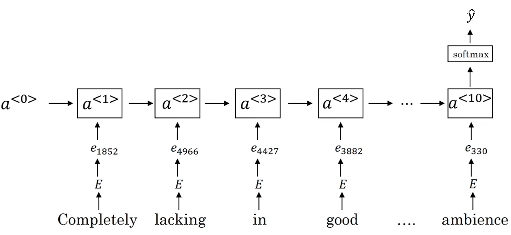

# Sequence Models

## 1 Recurrent Neural Networks

### 1.1 examples

### 1.2 Notations

$x$: example sequence
$y$: output
$x^{(i)<t>}$ : the t^th^ element in the i^th^ sequence $x^{(i)}$
$T_x^{(i)}$: the length of the $x^{(i)}$
$a$: activation

vocabulary: an n×1 vector (n=10,000 / 30,000 / 50,000 / 100,000 ...)
one-hot vector: an n×1 vector representing one word, only have one "1" and others are zeroes
UNK: unknown words

### 1.3 Recurrent Neural Network Model

#### why not a standard network?

a standard network:

problems: 

- Inputs, outputs can be defferent lengths in different examples.
- Doesn't share features learned across different positions of text.

#### Recurrent NN

$$
\begin{align}
a^{<0>}&: \vec{0} \text{ (vector of zeroes)}\\
a^{<t>}&=g([W_{aa} \ W_{ax}]\begin{bmatrix}a^{<t-1>}\\x^{<t>}\end{bmatrix}+b_a) \quad \quad \text{activation: tanh/ReLU}\\
\hat{y}^{<t>}&=g(W_{ya}a^{<t>}+b_y) \quad \quad \text{activation: sigmoid/softmax}\\
\text{Parameters: }& W_{aa},W_{ax},W_{ya},b_a,b_y\\
\mathcal{L}^{<t>}(\hat{y}^{<t>},y^{<t>})&=-y^{<t>}log\hat{y}^{<t>}-(1-y^{<t>})\\
\mathcal{L}(\hat{y},y)&=\sum\limits_{t=1}^{T_x}\mathcal{L}^{<t>}(\hat{y}^{<t>},y^{<t>})
\end{align}
$$

### 1.4 BackPropagation Through Time

forward propagation (blue):
$$
\begin{align}
\mathcal{L}^{<t>}(\hat{y}^{<t>},y^{<t>})&=-y^{<t>}log\hat{y}^{<t>}-(1-y^{<t>})\\
\mathcal{L}(\hat{y},y)&=\sum\limits_{t=1}^{T_x}\mathcal{L}^{<t>}(\hat{y}^{<t>},y^{<t>})
\end{align}
$$
backward propagation (red)

### 1.5 Different Types of RNNs

input length ($T_x$) and output length ($T_y$) can be different

#### many-to-one architecture

sentiment classification:
x=text, y=0/1 

#### one-to-one architecture

a standard, simple network

#### one-to-many architecture

music generation:
x=integer / Ø

#### many-to-many architecture

name entity recognition:
$T_x=T_y$

machine translation:
$T_x\neq T_y$

### 1.6 Language Model and Sequence Generation

language modelling: calculate $P(\text{sentence})/P(y^{<1>},y^{<2>},...,y^{<T_y>})$ 

training set: large **corpus** of English text
tokenize the sentence, add < EOS > to the end of the sentence, replace unknown word with < UNK >

#### RNN model

initialize with zeroes
Given the previous words, predict what the next word would be

$P(y^{<1>},y^{<2>},y^{<3>})=P(y^{<1>})\  P(y^{<2>}|y^{<1>}) \ P(y^{<3>}|y^{<1>},y^{<2>})$
$$
\mathcal{L}(\hat{y}^{<t>},y^{<t>})=-\sum\limits_iy^{<t>}_i log\hat{y}_i^{<t>}\\
\mathcal{L}=\sum\limits_t \mathcal{L}^{<t>}(\hat{y}^{<t>},y^{<t>})
$$

#### 2 types of models

1. word-level model

2. character-level model:
    - pros: needn't worry about < UNK >
    - cons: the sequence is much longer, less able to capture long range dependencies, computational expensive

### 1.7 Sampling Novel Sequences

1. initialize with zeroes
2. use np.random.choice() to pick a word
3. use generated words to predict the next word and pick one
4. generate a randomly chosen sentence from the RNN language model

### 1.8 Vanishing Gradients with RNN

For a deep network, because of vanishing gradients, it's hard to deal with long-range dependencies / catch long-range connections (difficult to "memorize" for a long time)

exploding gradients are easier to spot (numerical overflow) and solve (apply gradient clipping)

### 1.9 Gated Recurrent Unit (GRU)

#### simplified

$c^{<t>}$ : memory cell
$\Gamma_u$: gate ($\Gamma$ is like a gate and 'G'amma is for "Gate", 'u' is for "update"), decide when to update the $c$ value
$$
\begin{align}
c^{<t>}&=a^{<t>}\\
\tilde{c}^{<t>}&=tanh(W_c[c^{<t-1>}, \ x^{<t>}]+b_c)\\
\Gamma_u&=\sigma(W_c[c^{<t-1>}, \ x^{<t>}]+b_c)\\
c^{<t>}&=\Gamma_u * \tilde{c}^{<t>} + (1-\Gamma_u)*c^{<t-1>}
\end{align}
$$
$\Gamma_u$ is very likely to be 0 or a very small value, so the value of $c$ is likely to remain unchanged or change a little, which solves the vanishing gradients problem

vectorized: change some values of the memory cell at a time, maintaining the others

#### full

$\Gamma_r$: relevence gate (how much is $c^{<t-1>}$ correlated with $c^{<t>}$)
$$
\begin{align}
\tilde{c}^{<t>}&=tanh(W_c[\Gamma_r * c^{<t-1>}, \ x^{<t>}]+b_c)\\
\Gamma_u&=\sigma(W_c[c^{<t-1>}, \ x^{<t>}]+b_c)\\
\Gamma_r&=\sigma(W_r[c^{<t-1>}, \ x^{<t>}]+b_r)\\
c^{<t>}&=\Gamma_u * \tilde{c}^{<t>} + (1-\Gamma_u)*c^{<t-1>}
\end{align}
$$

### 1.10 LSTM (long short term memory) Unit

use $a$ instead of $c$ to compute the values of gates
$$
\begin{align}
\tilde{c}^{<t>}&=tanh(W_c[a^{<t-1>}, \ x^{<t>}]+b_c)\\
\text{update gate: } \quad
\Gamma_u&=\sigma(W_c[a^{<t-1>}, \ x^{<t>}]+b_c)\\
\text{forget gate: } \quad
\Gamma_f&=\sigma(W_f[a^{<t-1>}, \ x^{<t>}]+b_f)\\
\text{output gate: } \quad
\Gamma_o&=\sigma(W_o[a^{<t-1>}, \ x^{<t>}]+b_o)\\
c^{<t>}&=\Gamma_u * \tilde{c}^{<t>} + \Gamma_f*c^{<t-1>}\\
a^{<t>}&=\Gamma_o * c^{<t>}
\end{align}
$$

notice the red line: it's easy to pass the value of $c$ all the way down the network

peephole connection: add $c^{<t-1>}$ into the computation of $\Gamma$

### 1.11 Bidirectional RNN

use information from both directions to make predictions

downside: require the entire sequence of data (not appropriate for real-time speech recognition)

(form an acyclic graph)

### 1.12 Deep RNN

$$
\text{example:}\quad a^{[2]<3>}=g(W^{[2]}_a[a^{[2]<2>},a^{[1]<3>}]+b_a^{[2]})
$$
add layers with horizontal connections (usually don't add a lot)
add layers without horizontal connections to further compute the output $y$

## 2 NLP and Word Embeddings

### 2.1 Word Representation

#### vocabulary & one-hot vector:

treat each word independently, hard to generalize the cross words

$$
\text{Man:}\quad o_{5391}=\begin{bmatrix}0\\0\\ \vdots \\1 \\ 0 \\ \vdots \\0\end{bmatrix} \rightarrow \text{the 5391th element is 1}
$$

#### featurized representation: word embedding

for $n$ features, use a $n \times 1$ vector $e_{subscript}$ to represent a word
(somewhat similar to the face encoding)

$$
\text{Man:}\quad e_{5391}=\begin{bmatrix}-1\\0.01\\0.03\\0.09\end{bmatrix}
$$

visualize: use t-SNE to embed the words (vectors) into a 2D graph

### 2.2 Using Word Embeddings

1. Learn word embeddings from large text corpus. (1-100B words)
(Or download pre-trained embedding online.)
2. Transfer embedding to new task with smaller training set.
(say, 100k words)
3. Optional: Continue to finetune the word embeddings with new data. 
	(especially when step2 has a large training set)

### 2.3 Properties of Word Embeddings

#### analogies using word vectors

(after t-SNE, the vectors may not be parallel as shown in the graph)
$$
e_{man}-e_{woman} \approx
e_{king}-e_{queen} \approx \begin{bmatrix}-2\\0\\0\\0\end{bmatrix}\\
\begin{align}
\text{task:} &\quad e_{man}-e_{woman} \approx e_{king}-e_{?}\\
&\text{find word }w: \text{arg max } sim(e_w, e_{king}-e_{man}+e_{woman})
\end{align}
$$

#### cosine similarity

$$
sim(u,v)=\frac{u^Tv}{||u||_2||v||_2}
$$

### 2.4 Embedding Matrix

$E$: column-words, row-features
$$
E \cdot o_j=e_j \quad\quad \text{(not efficient in practice)}
$$
use a function to search for one column in the matrix

### 2.5 Learning Word Embeddings

use a 4-word size window, select the last 4 words as context 

#### other context/target pairs

build a language model:

- last 4 words

learn a word embedding:

- 4 words on left & right
- last 1 word
- nearby 1 word (skip gram)

### 2.6 Word2Vec

#### cBOW

#### skip-gram

vocab size = 10,000
content $c$ ("orange")(6257) → target t ("juice")(4834)
$$
o_c \rightarrow E \rightarrow e_c \rightarrow \text{softmax} \rightarrow\hat{y}\\
\text{softmax:} \quad \quad p(t|c)=\frac{e^{\theta_t^T e_c}}{\sum\limits_{j=1}^{10,000}e^{\theta_j^T e_c}}\\
\theta_t = \text{parameter associated with output t}\\
\mathcal{L}(\hat{y},y)=-\sum\limits_{i=1}^{10,000}y_ilog\hat{y}_i
$$
problems: computationally slow -- use **hierarchical softmax** or **negetive sampling**

### 2.7 Negative Sampling

 

pick $k$ words randomly* to create $k$ negative pairs
*somewhere in-between the extreme of taking uniform distribution and the other extreme of taking whatever was observed distribution in the training set (use the function below)
$$
P(w_i)=\frac{f(w_i)^{\frac{3}{4}}}{\sum\limits_{j=1}^{10,000}f(w_j)^{\frac{3}{4}}}
$$

$k=5 \sim 20 $  smaller data sets
$k=2 \sim 5$  larger data sets
$$
P(y=1|c,t)=\sigma(\theta_t^T e_c)\\
$$
the softmax layer predicts the possibility of each word in the dictionary (10,000 binary classifier), but only train the created $k+1$pairs (positive & negative)

### 2.8 GloVe Word Vectors

(Global Vectors for word representation)

$$
X_{ij}=\#\text{times } i \text{ appears in content of }j \\
\text{usually } X_{ij}=X_{ji} \\
\text{minimize} \quad  \sum\limits_{i=1}^{10,000}\sum\limits_{j=1}^{10,000}
f(X_{ij})(\theta_t^T e_j +b_t + b_j'- logX_{ij})^2\\
\text{weighting term} \quad f(X_{ij})=0 \ if \ X_{ij}=0
$$

- $f(X_{ij})$ can be a function (heuristic), neither give frequent words (e.g. the, of, a, ...) too much weight nor give infrequent word to little weight
- (only in this model) $\theta_i$ and $e_j$ are symmetric
	initialize them uniformly, use gradient descent to minimize the objective, and take the averge. $e^{(final)_w}=\frac{e_w+\theta_w}{2}$

### 2.9 Sentiment Classification

simplified

advanced (use RNN)

### 2.10 Debiasing Word Embeddings

Word embeddings can reflect gender, ethnicity, age, sexual orientation, and other biases of the text used to train the model.

1. Identify bias direction
	calculate the average of $e_{\text{he}}-e_{\text{she}}, e_{\text{male}}-e_{\text{female}},...$
	SVU (Singular Value Decomposition)
2. Neutralize: For every word that is not definitional, project to get rid of bias
3. Equalize pairs
    grandfather-grandmother, girl-boy, ...

## 3 Sequence to Sequence Models

### 3.1 Basic Models

machine translation

image caption

"a cat sitting on a chair"

### 3.2 Picking the Most Likely Sentence

machine translation model = encoder(green) + language model(purple)

$$
\text{arg max} \quad P(y^{<1>},y^{<2>}, ... y^{<T_y>} \ | \ x)
$$
need to come up with an algorithm that can actually find the value of $y$ that maximizes the term above -- find the most likely sentence

#### why not greedy search

based on previous words, pick the next best word one by one -- may not achieve global optimum

### 3.3 Beam Search Algorithm

$B$: beam width

1. for the first word, keep track of $B$ most possible outputs
2. evaluate the probability of the next word given the input sentence and the previous words
3. narrow down the number of choices from $B \times [\text{size of vocabulary}]$  to $B$
	$P(y^{<1>},y^{<2>} \ | \ x)=P(y^{<1>} \ | \ x) \times P(y^{<2>} \ | \ x)$
4. take on to the next beam search

only use $B$ copies of the network to evaluate all possible outputs

when $B=1$, it becomes greedy search

### 3.4 Refinements to Beam Search

#### length normalization

$$
\arg \max _{y} \prod_{t=1}^{T_{y}} P\left(y^{<t>} \mid x, y^{<1>}, \ldots, y^{<t-1>}\right)
$$

problem: numerical underflow
$$
\arg \max _{y} \sum\limits_{t=1}^{T_{y}} logP\left(y^{<t>} \mid x, y^{<1>}, \ldots, y^{<t-1>}\right)
$$
use the sum of log: more numerically stable
$$
\frac{1}{T_y^{\alpha}}\sum\limits_{t=1}^{T_{y}} logP\left(y^{<t>} \mid x, y^{<1>}, \ldots, y^{<t-1>}\right)
$$
**length normalization**: α is a hyperparameter (0~1)
use the score to evaluate different possible sentences in beam search and pick the best

#### beam width selection

large $B$: better result, faster
small $B$: worse result, slower

1 - 3 - 10 - 100 - 1000 ... when it's too large, the improvement becomes limited

Unlike exact search algorithms like BFS (Breadth First Search) or DFS (Depth First Search), Beam Search runs faster but is not guaranteed to find exact maximum for $arg \mathop{max}\limits_y P(y|x)$.

### 3.5 Error Analysis of Beam Search

find out whether the error lies in RNN or Beam Search

#### example:
Jane visite l'Afrique en septembre.
Human: Jane visits Africa in September. ($y^*$)
Algorithm: Jane visited Africa last September. ($\hat{y}$)

1. compute $P(y^*|x)$ and $P(\hat{y}|x)$ 
2. case 1: $P(y^*|x)>P(\hat{y}|x)$ 
	Beam Search chose $\hat{y}$, but $y^*$ attains higher $P(y|x)$ 
	Conclusion: Beam search is at fault.
3. case 2:  $P(y^*|x) \leq P(\hat{y}|x)$ 
	$y^*$ is a better translation than $\hat{y}$, but RNN predicted $P(y^*|x) < P(\hat{y}|x)$
	Conclusion: RNN model is at fault.

For different errors, go through the process above.
Figures out what faction of errors are “due to” beam search vs. RNN model

### 3.6 Bleu Score

bilingual evaluation understudy to human evaluation

#### example:

French: Le chat est sur le tapis.
Reference 1: The cat is on the mat.
Reference 2: There is a cat on the mat.
MT output: the the the the the the the.

- Precision: $\frac{7}{7}$ ("the" appears in the 2 references )
- Modified precision: $\frac{2}{7}$ ("the" appears 2 times in ref1 and 1 time 1 ref2)

Bleu:

Reference 1: The cat is on the mat.
Reference 2: There is a cat on the mat.
MT output: The cat the cat on the mat. ($\hat{y}$)

|         | Count | Count~clip~ |
| ------- | ----- | ----------- |
| the cat | 2     | 1           |
| cat the | 1     | 0           |
| cat on  | 1     | 1           |
| on the  | 1     | 1           |
| the mat | 1     | 1           |

$$
\text{unigram}\quad P_1=\frac{\sum\limits_{\text{unigram}\in \hat{y}}Count_{clip}(\text{unigram})}
{\sum\limits_{\text{unigram}\in \hat{y}}Count(\text{unigram})}\\
\text{n-gram}\quad P_n=\frac{\sum\limits_{\text{n-grams}\in \hat{y}}Count_{clip}(\text{n-gram})}
{\sum\limits_{\text{n-grams}\in \hat{y}}Count(\text{n-gram})}\\
$$
if completely same, then $P_1=P_2=...=1.0$

$$
p_n=\text{Bleu score on n-grams only}\\
\text{combined Bleu score:}\quad BP \ exp(\frac{1}{4}\sum\limits_{n=1}^4p_n)\\
BP=\text{brevity penalty}\\
\left.
BP=
\right \{
\begin{aligned}
&1 \qquad\qquad\qquad\qquad \text{if MT_output_length > reference_ output_ length}\\
&exp(1 - \text{MT_output _length/reference_output_length}) \qquad \text{otherwise}
\end{aligned}
$$
brevity penalty: penalize translation systems that output translations that are too short (because short translations are easier to achieve higher scores)

### 3.7 Attention Model

the problem of long sequences:

#### model

$\alpha^{<t,t'>}$: (attention weights) amount of attention $y^{<t>}$ should pay to $a^{<t'>}$ (when generating the $t^{th}$ word, how much attention about the $t'^{th}$ input word should be considered)

$s^{<t>}$: hidden state activation from the $t^{th}$ time step

use a simple network to calculate $e^{<t,t'>}$ and then $a^{<t,t'>}$

$$
\begin{align}
\alpha^{<t,t'>}&=\frac{exp(e^{<t,t'>})}{\sum\limits_{t'=1}^{T_x}exp(e^{<t,t'>})}\\
a^{<t'>}&=(\stackrel{\rightarrow}a^{<t'>}, \stackrel{\leftarrow}a^{<t'>})\\
\sum\limits_{t'}\alpha^{<1,t'>}&=1\\
c^{<1>}&=\sum\limits_{t'}\alpha^{<1,t'>}a^{<t'>}\\
\end{align}
$$
downside: $O(n^3)$

### 3.8 Speech Recognition

phoneme: (not necessary in end-to-end network)

#### attention model

#### CTC cost for speech recognition

(Connectionist temporal classification)

the number of outputs = the number of inputs

basic rule: collapse repeated characters not seperated by "blank"

### 3.9 Trigger Word Detection

before the trigger word is said: output 0
right after the trigger word is said: output several 1s

## 4 Summary

deep learning is a kind of superpower
use it to do sth for humanity and make life better

2020.08
Marcus
Written with Typora