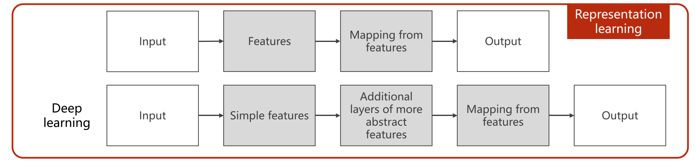
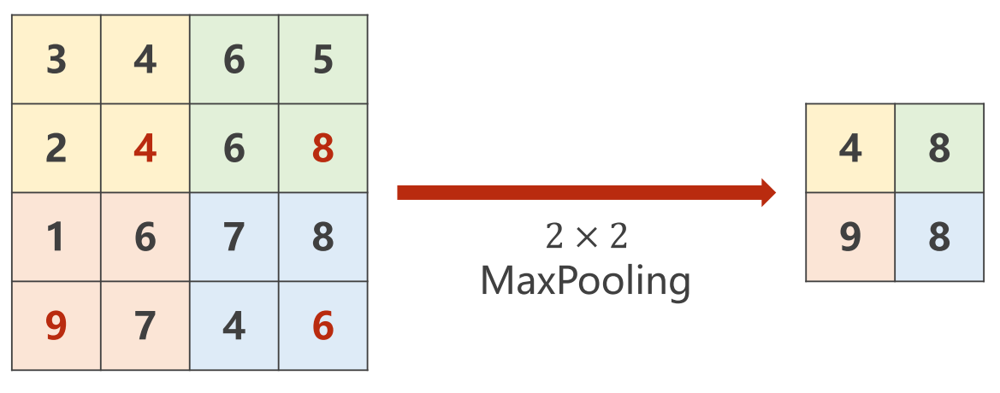

# PyTorch

## 1 Overview

### 1.1 Goal:

- How to implement learning system using PyTorch
- Understand the basic of neural networks / deep learning

pytorch version 0.4
basic algebra + probability + python

new tech：development - decline - "ice age" - application/disappear

### 1.2 Machine learning

#### compared with human intelligence

information - infer
image - prediction


### 1.3 How to develop a learning system

#### earlier architecture：


downside: too much rules are difficult for maintenance

#### classic machine learning：



#### representation learning：


- Curse of dimensionality: the feature space becomes increasingly sparse for an increasing number of dimensions of a fixed-size training dataset
	Compress high-dimensional information into low-dimensions and saving as much information as possible

New challenge:

- Limit of hand-designed feature.
- SVM can not handle big data set well.
- More and more application need to handle unstructured data.

### 1.4 Brief history of NN

from neuroscience to mathematics & engineering


use computational graph to implement backprop

LeNet-5(1998), AlexNet(2012), GoogLeNet&VGG(2014), ResNet(2015)

### 1.5 About PyTorch

PyTorch is a python package that provides two high-level features:
- Tensor computation (like numpy) with strong GPU acceleration
- Deep Neural Networks built on a tape-based autodiff system

Dynamical graph
- More flexible
- Easy to debug
- Intuitive and cleaner code

More neural networkic
- Write code as network works
- AutoGrad for forward / backward


## 2 Linear Model

example:

1. divide the data set into training set , dev set & test set (see also deeplearning 2.1.1)
2. model design: use linear model $\hat{y}=x*\omega$
3. starts with a random guess, $\omega$=a random value
4. error analysis $\text{loss}=(\hat{y}-y)^{2}=(x * \omega-y)^{2} \quad \text{cost}=\frac{1}{N} \sum_{n=1}^{N}\left(\hat{y}_{n}-y_{n}\right)^{2}$
5. visualization: draw the graph (visdom)
6. save the output regularly

code (2_graph.py)

```python
import numpy as np
import matplotlib.pyplot as plt

x_data = [1.0, 2.0, 3.0]
y_data = [2.0, 4.0, 6.0]

def forward(x):
    return x * w

def loss(x, y):
    y_pred = forward(x)
    return (y_pred - y)** 2

w_list = []
mse_list = []
for w in np.arange(0.0, 4.1, 0.1):
    print('w=', w)
    l_sum = 0
    for x_val, y_val in zip(x_data, y_data):
        y_pred_val = forward(x_val)
        loss_val = loss(x_val, y_val)
        l_sum += loss_val
        print('\t', x_val, y_val, y_pred_val, loss_val)
    print('MSE=', l_sum / 3)
    w_list.append(w)
    mse_list.append(l_sum / 3)

plt.plot(w_list, mse_list)
plt.ylabel('Loss')
plt.xlabel('w')
plt.show()
```


## 3 Gradient Descent

(see also deeplearning 1.2.3)

optimization problem
$\omega^{*}=\underset{\omega}{\arg \min } \operatorname{cost}(\omega)$

local optima & global optima & saddle points (see also deeplearning 2.2.7)

example: 


code: (3_gradientdescent.py)

```python
import numpy as np
import matplotlib.pyplot as plt

x_data = [1.0, 2.0, 3.0]
y_data = [2.0, 4.0, 6.0]

w = 1.0  # initial guess of weight

def forward(x):
    return x * w

def cost(xs, ys):
    cost = 0
    for x, y in zip(xs, ys):
        y_pred = forward(x)
        cost += (y_pred - y)** 2
    return cost / len(xs)
    
def gradient(xs, ys):
    grad = 0
    for x, y in zip(xs, ys):
        grad += 2 * x * (x * w - y)
    return grad / len(xs)

epoch_list = []
cost_list = []
print('Predict (before training)', 4, forward(4))
for epoch in range(100):
    cost_val = cost(x_data, y_data)
    grad_val = gradient(x_data, y_data)
    w -= 0.01 * grad_val  # learning rate = 0.01
    print('Epoch:', epoch, 'w=', w, 'loss=', cost_val)
    epoch_list.append(epoch)
    cost_list.append(cost_val)
print('Predict (after training)', 4, forward(4))

plt.plot(epoch_list, cost_list)
plt.ylabel('Cost')
plt.xlabel('Epoch')
plt.show()
```


### stochastic gradient descent


code: (3_SGD.py)

```python
# pytorch tutorial - 3 gradient descent

import numpy as np
import matplotlib.pyplot as plt

x_data = [1.0, 2.0, 3.0]
y_data = [2.0, 4.0, 6.0]

w = 1.0  # initial guess of weight

def forward(x):
    return x * w

def loss(x, y):
    y_pred = forward(x)
    return (y_pred - y)** 2

def gradient(x, y):
    return 2 * x * (x * w - y)

epoch_list = []
loss_list = []
# Update weight by every grad of sample of training set.
print('Predict (before training)', 4, forward(4))
for epoch in range(100):
    loss_val = 0
    for x, y in zip(x_data, y_data):
        grad = gradient(x, y)
        w -= 0.01 * grad
        print("\tgrad:", x, y, grad)
        l = loss(x, y)
        loss_val += l
    loss_val /= 3.0
    print('progress:', epoch, 'w=', w, 'loss=', l)
    epoch_list.append(epoch)
    loss_list.append(loss_val)
print('Predict (after training)', 4, forward(4))

plt.plot(epoch_list, loss_list)
plt.ylabel('Loss')
plt.xlabel('Epoch')
plt.show()


```


## 4 Back Propagation

chain rule:

1. create computational graph (forward)
2. local gradient
3. given gradient from successive node
4. use chain rule to compute the gradient (backward)


### Tensor in PyTorch

In PyTorch, Tensor is the important component in constructing dynamic computational graph.
It contains **data** and **grad**, which storage the value of node and gradient w.r.t loss respectively.

code: (4_linear.py, 4_exercise.py)

```python
# 4_linear.py
import torch

x_data = [1.0, 2.0, 3.0]
y_data = [2.0, 4.0, 6.0]

w = torch.Tensor([1.0])
w.requires_grad = True  # need to compute its grad

def forward(x):
    return x * w  # overload
# the return value is "require_grad=True"

def loss(x, y):
    y_pred = forward(x)
    return (y_pred - y)** 2

print('Predict (before training)', 4, forward(4).item())

for epoch in range(100):
    for x, y in zip(x_data, y_data):
        l = loss(x, y)  # create a graph (renewed in each loop)
        l.backward()  # compute grad
        print("\tgrad:", x, y, w.grad.item())
        w.data = w.data - 0.01 * w.grad.data
        w.grad.data.zero_()  # The grad computed by .backward() will be accumulated. So after update, remember set the grad to ZERO!!!
    print('progress:', epoch, l.item())
```


## 5 Linear Regression with PyTorch

learn from official tutorial

### 5.1 Prepare dataset


### 5.2 Design model using class

inherit from nn.Module

if pytorch can't calculate the derivative of your function:

1. try to decompose your function into existing functions
2. write your own code in torch.nn.Functions instead of inherit from nn.Module

### 5.3 Construct loss and optimizer

using PyTorch API

optimizer: Adagrad, Adam, Adamax, ASGD, LBFGS, RMSprop, Rprop, SGD ...

### 5.4 Training cycle

forward, backward, update

code: (5_lregression.py)

```python
import torch

x_data = torch.Tensor([[1.0], [2.0], [3.0]])
y_data = torch.Tensor([[2.0], [4.0], [6.0]])

# Our model class should be inherit from nn.Module, which is Base class for all neural network modules.
class LinearModel(torch.nn.Module):
    def __init__(self):
        super(LinearModel, self).__init__()
        self.linear = torch.nn.Linear(1, 1)  # initialize w & b
    
    def forward(self, x):
        y_pred = self.linear(x)
        return y_pred
# Class nn.Linearhas implemented the magic method __call__(), which enable the instance of the class can be called just like a function. Normally the forward() will be called.


model = LinearModel()  # callable

criterion = torch.nn.MSELoss(size_average=False)
optimizer = torch.optim.SGD(model.parameters(), lr=0.01)
# params (iterable) - iterable of parameters to optimize or dicts defining parameter groups 


for epoch in range(500):
    y_pred = model(x_data)  # forward
    loss = criterion(y_pred, y_data)
    print(epoch, loss.item())

    optimizer.zero_grad()
    loss.backward()  # backward
    optimizer.step()  # update
# output w and b
print('w=', model.linear.weight.item())
print('b=', model.linear.bias.item())
# test model
x_test = torch.Tensor([[4.0]])
y_test = model(x_test)
print('y_pred = ', y_test.data)

```


## 6 Logistic Regression

**(see also deeplearning 2.2)**

### Classification

- the MNIST Dataset (the database of handwritten digits)
- the CIFAR-10 Dataset

output: $P(\hat{y}=1)$
mapping: $\mathbb{R} \rightarrow (0,1)$
using sigmoid functions:


$\hat{y}=\sigma(x*\omega+b)$

relative entropy (KL divergence ) / cross entropy
BCEloss (Binary Cross Entropy): $loss = -(ylog \ \hat{y}+(1-y)log(1-\hat{y}))$

code: (6_logistic.py)

```python
import torch
import numpy as np
import matplotlib.pyplot as plt
import os

os.environ['KMP_DUPLICATE_LIB_OK']='True' #???

x_data = torch.Tensor([[1.0], [2.0], [3.0]])
y_data = torch.Tensor([[0], [0], [10]])

class LogisticRegressionModel(torch.nn.Module):
    def __init__(self):
        super(LogisticRegressionModel, self).__init__()
        self.linear = torch.nn.Linear(1, 1)
    
    def forward(self, x):
        y_pred = torch.nn.functional.sigmoid(self.linear(x))
        return y_pred
model = LogisticRegressionModel()

criterion = torch.nn.BCELoss(size_average=False)
optimizer = torch.optim.SGD(model.parameters(), lr=0.01)

for epoch in range(500):
    y_pred = model(x_data)
    loss = criterion(y_pred, y_data)
    print(epoch, loss.item())

    optimizer.zero_grad()
    loss.backward()
    optimizer.step()

print('w=', model.linear.weight.item())
print('b=', model.linear.bias.item())

x_test = torch.Tensor([[4.0]])
y_test = model(x_test)
print('y_pred = ', y_test.data)

x = np.linspace(0, 10, 200)
x_t = torch.Tensor(x).view((200, 1))
y_t = model(x_t)
y = y_t.data.numpy()
plt.plot(x, y)
plt.plot([0, 10], [0.5, 0.5], c='r')
plt.xlabel('Hours')
plt.ylabel('Probability of Pass')
plt.grid()
plt.show()
```


## 7 Multiple Dimension Input

**read documents, understand the underlying architecture -- generalization capability**

- use layers to change the dimensions


- different activation functions


code: (7_diabetes1.py)

```python
import numpy as np
import torch

xy = np.loadtxt('.\data\diabetes.csv', delimiter=',', dtype=np.float32)  # use float32 instead of double due to the GPU
x_data = torch.from_numpy(xy[:, : -1])
y_data = torch.from_numpy(xy[:, [-1]])  # ???

class Model(torch.nn.Module):
    def __init__(self):
        super(Model, self).__init__()
        self.linear1 = torch.nn.Linear(8, 6)
        self.linear2 = torch.nn.Linear(6, 4)
        self.linear3 = torch.nn.Linear(4, 1)
        self.sigmoid = torch.nn.Sigmoid()
    def forward(self, x):
        x = self.sigmoid(self.linear1(x))
        x = self.sigmoid(self.linear2(x))
        x = self.sigmoid(self.linear3(x))
        return x
model = Model()

criterion = torch.nn.BCELoss(size_average=True)
optimizer = torch.optim.SGD(model.parameters(), lr=0.1)

for epoch in range(100):
    y_pred = model(x_data)  # doesn't use mini-batch
    loss = criterion(y_pred, y_data)
    print(epoch, loss.item())

    optimizer.zero_grad()
    loss.backward()

    optimizer.step()
```


## 8 Dataset & Dataloader

- Epoch: One forward pass and one backward pass of all the training examples
- Batch-size: The number of training examples in one forward backward pass
- Iteration: Number of passes, each pass using [batch size] number of examples

### Dataloader

batch_size = ...   shuffle = ...


depending on the dataset's size, load all data / the file's name during initialization

code: (8_diabetes2.py)

```python
import torch
import numpy as np
from torch.utils.data import Dataset  # Dataset is an abstract class. We can define our class inherited from this class.
from torch.utils.data import DataLoader  # DataLoader is a class to help us loading data in PyTorch.

class DiabetesDataset(Dataset):  # DiabetesDataset is inherited from abstract class Dataset.
    def __init__(self, filepath):
        xy = np.loadtxt(filepath, delimiter=',', dtype=np.float32)
        self.len = xy.shape[0]
        self.x_data = torch.from_numpy(xy[:, : -1])
        self.y_data = torch.from_numpy(xy[:, [-1]])
    def __getitem__(self, index):  # The expression, dataset[index], will call this magic function.
        return self.x_data[index], self.y_data[index]
    def __len__(self):  # This magic function returns length of dataset.
        return self.len

dataset = DiabetesDataset('.\data\diabetes.csv')  # Construct DiabetesDataset object.
train_loader = DataLoader(dataset=dataset, batch_size=32, shuffle=True, num_workers=2)
# Initialize loader with batch-size, shuffle, process number.

class Model(torch.nn.Module):
    def __init__(self):
        super(Model, self).__init__()
        self.linear1 = torch.nn.Linear(8, 6)
        self.linear2 = torch.nn.Linear(6, 4)
        self.linear3 = torch.nn.Linear(4, 1)
        self.sigmoid = torch.nn.Sigmoid()
    def forward(self, x):
        x = self.sigmoid(self.linear1(x))
        x = self.sigmoid(self.linear2(x))
        x = self.sigmoid(self.linear3(x))
        return x
model = Model()

criterion = torch.nn.BCELoss(size_average=True)
optimizer = torch.optim.SGD(model.parameters(), lr=0.01)

# The implementation of multiprocessing is different on Windows, which uses spawn instead of fork(in Linux).
# So we have to wrap the code with an if-clause to protect the code from executing multiple times.
if __name__ == '__main__':
    for epoch in range(100):
        for i, data in enumerate(train_loader, 0):
            inputs, labels = data   # 1. Prepare data
            y_pred = model(inputs)  # 2. Forward
            loss = criterion(y_pred, labels)
            print(epoch, i, loss.item())  
            optimizer.zero_grad()  # 3. Backward
            loss.backward()
            optimizer.step()  # 4. Update
```

- torch.utils.data.Dataset
	MNIST, ...


## 9 Softmax Classifier

**(see also deeplearning 2.3.5)**


#### MNIST


```python
import torch
from torchvision import transforms
from torchvision import datasets
from torch.utils.data import DataLoader
import torch.nn.functional as F  # For using function relu()
import torch.optim as optim  # For constructing Optimizer

batch_size = 64
transform = transforms.Compose([
    transforms.ToTensor(),  # Convert the PIL(python image library) Image to Tensor
    transforms.Normalize((0.1307, ), (0.3081, ))  # The parameters are mean and std respectively
])
train_dataset = datasets.MNIST(root='./data/mnist',train=True, download=True, transform=transform)
train_loader = DataLoader(train_dataset, shuffle=True, batch_size=batch_size)
test_dataset = datasets.MNIST(root='./data/mnist', train=False, download=True, transform=transform)
test_loader = DataLoader(test_dataset, shuffle=False, batch_size=batch_size)

class Net(torch.nn.Module):
    def __init__(self):
        super(Net, self).__init__()
        self.l1 = torch.nn.Linear(784, 512)
        self.l2 = torch.nn.Linear(512, 256)
        self.l3 = torch.nn.Linear(256, 128)
        self.l4 = torch.nn.Linear(128, 64)
        self.l5 = torch.nn.Linear(64, 10)
    def forward(self, x):
        x = x.view(-1, 784)
        x = F.relu(self.l1(x))  # use ReLU
        x = F.relu(self.l2(x))
        x = F.relu(self.l3(x))
        x = F.relu(self.l4(x))
        return self.l5(x)
model = Net()

criterion = torch.nn.CrossEntropyLoss()
optimizer = optim.SGD(model.parameters(), lr=0.01, momentum=0.5)

def train(epoch):
    running_loss = 0.0
    for batch_idx, data in enumerate(train_loader, 0):
        inputs, target = data
        optimizer.zero_grad()
        
        # forward + backward + update
        outputs = model(inputs)
        loss = criterion(outputs, target)
        loss.backward()
        optimizer.step()
        running_loss += loss.item()

        if batch_idx % 300 == 299:  # output the running loss every 300 times
            print('[%d, %5d] loss: %.3f' % (epoch + 1, batch_idx + 1, running_loss / 300))
            running_loss = 0.0

def test():
    correct = 0
    total = 0
    with torch.no_grad():  # needn't calculated the grad
        for data in test_loader:
            images, labels = data
            outputs = model(images)
            _, predicted = torch.max(outputs.data, dim=1)  # dim=0:column(y), 1:row(x), function max():return the maximum's value & subscript in the dim direction
            total += labels.size(0) # size is a tuple (N*M)
            correct += (predicted == labels).sum().item()
    print('Accuracy on test set: %d %%' % (100 * correct / total))

if __name__ == '__main__':
    for epoch in range(10):
        train(epoch)
        test()
```


## 10 Basic CNN

(see also deeplearning 4)

### conv layer

```python
import torch

in_channels, out_channels = 5, 10
width, height = 100, 100
kernel_size = 3
batch_size = 1

input = torch.randn(batch_size, in_channels, width, height)
conv_layer = torch.nn.Conv2d(in_channels, out_channels, kernel_size=kernel_size) # can add padding/stride parameters
output = conv_layer(input)

print(input.shape)
print(output.shape)
print(conv_layer.weight.shape)
```


### maxpooling



```python
import torch

input = [3, 4, 6, 5,
         2, 4, 6, 8,
         1, 6, 7, 8,
         9, 7, 4, 6,
]
input = torch.Tensor(input).view(1, 1, 4, 4)
maxpooling_layer = torch.nn.MaxPool2d(kernel_size=2)
output = maxpooling_layer(input)
print(output)
```

### conv + MNIST


code: (10_convMNIST_gpu.py)

```python
import torch
from torchvision import transforms
from torchvision import datasets
from torch.utils.data import DataLoader
import torch.nn.functional as F
import torch.optim as optim

batch_size = 64
transform = transforms.Compose([
    transforms.ToTensor(), 
    transforms.Normalize((0.1307, ), (0.3081, ))
])
train_dataset = datasets.MNIST(root='./data/mnist',train=True, download=True, transform=transform)
train_loader = DataLoader(train_dataset, shuffle=True, batch_size=batch_size)
test_dataset = datasets.MNIST(root='./data/mnist', train=False, download=True, transform=transform)
test_loader = DataLoader(test_dataset, shuffle=False, batch_size=batch_size)

class Net(torch.nn.Module):
    def __init__(self):
        super(Net, self).__init__()
        self.conv1 = torch.nn.Conv2d(1, 10, kernel_size=5)
        self.conv2 = torch.nn.Conv2d(10, 20, kernel_size=5)
        self.pooling = torch.nn.MaxPool2d(2)
        self.fc = torch.nn.Linear(320, 10)
    def forward(self, x):
        # Flatten data from (n, 1, 28, 28) to (n, 784)
        batch_size = x.size(0)
        x = F.relu(self.pooling(self.conv1(x)))
        x = F.relu(self.pooling(self.conv2(x)))
        x = x.view(batch_size, -1)  # flatten 
        x = self.fc(x)
        return x
model = Net()

# Define device as the first visible cuda device if we have CUDA available.
device = torch.device("cuda:0" if torch.cuda.is_available() else "cpu")
model.to(device)

criterion = torch.nn.CrossEntropyLoss()
optimizer = optim.SGD(model.parameters(), lr=0.01, momentum=0.5)

def train(epoch):
    running_loss = 0.0
    for batch_idx, data in enumerate(train_loader, 0):
        inputs, target = data
        inputs, target = inputs.to(device), target.to(device)  # Send the inputs and targets at every step to the GPU.
        optimizer.zero_grad()
        # forward + backward + update 
        outputs = model(inputs)
        loss = criterion(outputs, target)
        loss.backward()
        optimizer.step()
        running_loss += loss.item()
        if batch_idx % 300 == 299:
            print('[%d, %5d] loss: %.3f' % (epoch + 1, batch_idx + 1, running_loss / 2000))
            running_loss = 0.0

def test():
    correct = 0
    total = 0
    with torch.no_grad():
        for data in test_loader:
            inputs, target = data
            inputs, target = inputs.to(device), target.to(device)
            outputs = model(inputs)
            _, predicted = torch.max(outputs.data, dim=1)
            total += target.size(0)
            correct += (predicted == target).sum().item()
    print('Accuracy on test set: %d %% [%d/%d]' % (100 * correct / total, correct, total))

if __name__ == '__main__':
    for epoch in range(10):
        train(epoch)
        test()
```


## 11 Advanced CNN

- reduce code redundant: use functions/ classes
- Back up the NN (parameters) when the test set result reaches an all-time high

### 1×1 convolution: (see also deeplearning 4.2.3, 4.2.4)
reduce computational cost

### Inception

GoogLeNet 

(see also deeplearning 4.2.5)

example


```python
class InceptionA(nn.Module):
    def __init__(self, in_channels):
        super(InceptionA, self).__init__()
        self.branch1x1 = nn.Conv2d(in_channels, 16, kernel_size=1)
        self.branch5x5_1 = nn.Conv2d(in_channels, 16, kernel_size=1)
        self.branch5x5_2 = nn.Conv2d(16, 24, kernel_size=5, padding=2)
        self.branch3x3_1 = nn.Conv2d(in_channels, 16, kernel_size=1)
        self.branch3x3_2 = nn.Conv2d(16, 24, kernel_size=3, padding=1)
        self.branch3x3_3 = nn.Conv2d(24, 24, kernel_size=3, padding=1)
        self.branch_pool = nn.Conv2d(in_channels, 24, kernel_size=1)

    def forward(self, x):
        branch1x1 = self.branch1x1(x)
        branch5x5 = self.branch5x5_1(x)
        branch5x5 = self.branch5x5_2(branch5x5)
        branch3x3 = self.branch3x3_1(x)
        branch3x3 = self.branch3x3_2(branch3x3)
        branch3x3 = self.branch3x3_3(branch3x3)
        branch_pool = F.avg_pool2d(x, kernel_size=3, stride=1, padding=1)
        branch_pool = self.branch_pool(branch_pool)
        outputs = [branch1x1, branch5x5, branch3x3, branch_pool]
        return torch.cat(outputs, dim=1)

class Net(nn.Module):
    def __init__(self):
        super(Net, self).__init__()
        self.conv1 = nn.Conv2d(1, 10, kernel_size=5)
        self.conv2 = nn.Conv2d(88, 20, kernel_size=5)
        self.incep1 = InceptionA(in_channels=10)
        self.incep2 = InceptionA(in_channels=20)
        self.mp = nn.MaxPool2d(2)
        self.fc = nn.Linear(1408, 10)
    def forward(self, x):
        in_size = x.size(0)
        x = F.relu(self.mp(self.conv1(x)))
        x = self.incep1(x)
        x = F.relu(self.mp(self.conv2(x)))
        x = self.incep2(x)
        x = x.view(in_size, -1)
        x = self.fc(x)
        return x
```

### Residual Network

(see also deeplearning 2.2.2)


```python
class ResidualBlock(nn.Module):
    def __init__(self, channels):
        super(ResidualBlock, self).__init__()
        self.channels = channels
        self.conv1 = nn.Conv2d(channels, channels, kernel_size=3, padding=1)
        self.conv2 = nn.Conv2d(channels, channels, kernel_size=3, padding=1)
    def forward(self, x):
        y = F.relu(self.conv1(x))
        y = self.conv2(y)
        return F.relu(x + y)
```


some advice

- Theory: read *Deep Learning*
- Read the PyTorch document
- Reproduction of classic models (read the code & write)
- Expand your horizons


## 12 Basic RNN

### RNN cell


- Suppose we have sequence with below properties:
batchsize = 1
seqLen = 3
inputSize = 4
hiddenSize = 2
- So the shape of inputs and outputs of RNNCell:
input.shape = (batchSize, inputSize)
output.shape = (batchSize, hiddenSize)
- The sequence can be warped in one Tensor with shape:
dataset.shape = (seqLen, batchSize, inputSize)

```python
import torch

batch_size = 1
seq_len = 3
input_size = 4
hidden_size = 2

cell = torch.nn.RNNCell(input_size=input_size, hidden_size=hidden_size)  # Construction of RNNCell

# (seq, batch, features)
dataset = torch.randn(seq_len, batch_size, input_size)  # Wrapping the sequence into: (seqlen, batchsize, inputsize)
hidden = torch.zeros(batch_size, hidden_size)  # Initializing the hidden to zero

for idx, input in enumerate(dataset):
    print('=' * 20, idx, '=' * 20)
    print('Input size: ', input.shape)
    hidden = cell(input, hidden)  # The shape of input is:(batchsize, inputsize)
    print('hidden size: ', hidden.shape)
    print(hidden)
```

### RNN network


(same color -- same cell)

```python
import torch

batch_size = 1
seq_len = 3
input_size = 4
hidden_size = 2
num_layers = 1

cell = torch.nn.RNN(input_size=input_size, hidden_size=hidden_size, num_layers=num_layers)

# (seqLen, batchSize, inputSize)
inputs = torch.randn(seq_len, batch_size, input_size)
hidden = torch.zeros(num_layers, batch_size, hidden_size)
out, hidden = cell(inputs, hidden)

print('Output size:', out.shape)
print('Output:', out)
print('Hidden size: ', hidden.shape)
print('Hidden: ', hidden)
```

- batch-first (in torch.nn.RNN)

	```python
	cell = torch.nn.RNN(input_size=input_size, hidden_size=hidden_size, num_layers=num_layers, batch-first=True)
	# inputs = torch.randn(seq_len, batch_size, input_size)
	inputs = torch.randn(batch_size, seq_len, input_size)
	```

### example: hello

Train a model to learn:  “hello”-> “ohlol”

#### one-hot

- One-hot encoding of words and characters:
	- The one-hot vectors are high-dimension.
	- The one-hot vectors are sparse. 
	- The one-hot vectors are hardcoded.

#### embedding


code: (12_hello_embed.py)

```python
import torch

num_class = 4
input_size = 4
hidden_size = 8
embedding_size = 10
num_layers = 2
batch_size = 1
seq_len = 5

idx2char = ['e', 'h', 'l', 'o']
x_data = [[1, 0, 2, 2, 3]]  # (batch, seq_len) 
y_data = [3, 1, 2, 3, 2] # (batch * seq_len)
inputs = torch.LongTensor(x_data)
labels = torch.LongTensor(y_data)

class Model(torch.nn.Module):
    def __init__(self):
        super(Model, self).__init__()
        self.emb = torch.nn.Embedding(input_size, embedding_size)  # look up matrix of embedding
        self.rnn = torch.nn.RNN(input_size=embedding_size, hidden_size=hidden_size, num_layers=num_layers, batch_first=True)
        self.fc = torch.nn.Linear(hidden_size, num_class)
    def forward(self, x):
        hidden = torch.zeros(num_layers, x.size(0), hidden_size)
        x = self.emb(x)  # (batch, seqLen, embeddingSize)
        x, _ = self.rnn(x, hidden)
        x = self.fc(x)
        return x.view(-1, num_class)  # reshape result to Cross Entropy Loss (batchSize*seqLen, numClass)
net = Model()

criterion = torch.nn.CrossEntropyLoss()
optimizer = torch.optim.Adam(net.parameters(), lr=0.05)

for epoch in range(15):
    optimizer.zero_grad()
    outputs = net(inputs)
    loss = criterion(outputs, labels)
    loss.backward()
    optimizer.step()

    _, idx = outputs.max(dim=1)
    idx = idx.data.numpy()
    print('Predicted:', ''.join([idx2char[x] for x in idx]), end='')
    print(', Epoch [%d/15] loss = %.3f' % (epoch + 1, loss.item()))
```


## 13 RNN Classifier

### example: Name Classifier


bi-direction RNN:


code: (13_nameclassifier.py)


- importance sampling


## Tasks

Build DataLoader for Titanic dataset: https://www.kaggle.com/c/titanic/data

Build a classifier using the DataLoader

What are the differences? CrossEntropyLoss vs NLLLoss
Reading the document:
https://pytorch.org/docs/stable/nn.html#crossentropyloss
https://pytorch.org/docs/stable/nn.html#nllloss

Try to know why:
CrossEntropyLoss <==> LogSoftmax + NLLLoss

Try to implement a classifier for: 
Otto Group Product Classification Challenge
Dataset: https://www.kaggle.com/c/otto-group-product-classificationchallenge/data

data preload

use LSTM / GRU

The Rotten Tomatoes movie review dataset is a corpus of movie reviews used for sentiment analysis. 
dataset: https://www.kaggle.com/c/sentiment-analysis-on-movie-reviews/data • The dataset is comprised of tab-separated files with phrases from the Rotten Tomatoes dataset.